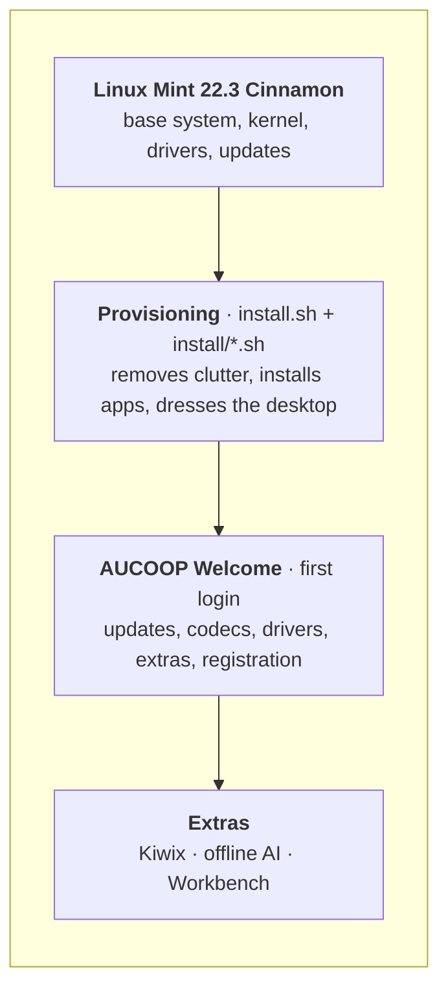
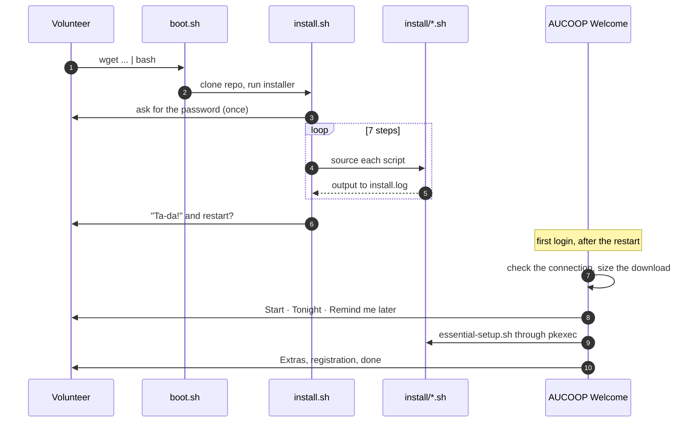

# Architecture

AUCOOP Mint is a layer on top of Linux Mint, not a fork of it. Mint handles the installer, the kernel, the drivers and the security updates; we change what the machine looks like and what's installed on it. Nobody here maintains a distribution, and the laptop keeps getting updates from Mint for as long as 22.x is supported.

## Two moments in time

Everything happens either while you're preparing the laptop, or at the recipient's first login. Splitting it that way is deliberate: provisioning is fast and predictable, while the slow, bandwidth-hungry work waits until someone can decide when to spend the data.

## Why it's built this way

**Shell scripts, not a configuration system.** Every step is a short, readable `.sh` file. A volunteer with basic Linux knowledge can open `install/chrome.sh` and see exactly what it does. Adding Ansible or Puppet here would buy nothing and cost a dependency.

**Steps you can rerun.** Anything can be run twice. That matters when a download fails halfway on a bad link, which is the normal case, not the exception.

**Privileged work goes through one door.** AUCOOP Welcome never runs as root. When it needs root it calls `pkexec-runner.sh` with an action name, and the system asks for the password itself. Adding a new privileged action means adding a case there, not sprinkling `sudo` around a GTK app.

**Nothing assumes internet at first boot.** The connection check happens before any download, and every path has an answer for "not now".

## Components

| Piece | Lives in | Language |
|---|---|---|
| Bootstrap one-liner | `boot.sh` | bash |
| Provisioning steps | `install.sh`, `install/` | bash |
| Installer screen (logo, steps, progress) | `lib/ui.sh`, `lib/logo.sh` | bash |
| Installer and Welcome texts, 5 languages | `lib/i18n.sh`, `aucoop-welcome/welcome_i18n.py` | bash, Python |
| First-login app | `aucoop-welcome/aucoop_welcome.py` | Python + GTK 3 |
| Privileged actions | `aucoop-welcome/pkexec-runner.sh` and friends | bash |
| Device registration | `aucoop-workbench/` (submodule) | Python |
| Recovery ISO builder | `build-iso.sh`, `configs/` | bash |

## What we change on the system

Removed: Firefox, LibreOffice, Thunderbird, Transmission, Seahorse, Hypnotix, Warpinator, Webapp Manager, HexChat.

Added: Chrome, OnlyOffice with Word/Excel/PowerPoint launchers, Flathub, the AUCOOP Welcome app, Workbench.

Configured: Mint-Y-Blue theme, DMZ-White cursor, AUCOOP wallpaper and login background, taskbar layout, menu button icon, menu search aliases, and Mint's own welcome window switched off.

Left for first login: updates, codecs, drivers, Kiwix, the AI assistant, device registration.
