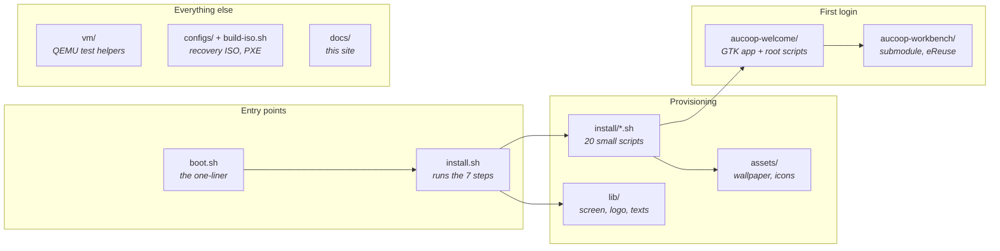

# Repository map

Where things live, for when you're looking for the file that does the thing.

## Provisioning steps

`install.sh` groups these into the seven steps you see on screen. Each one is short enough to read in a minute.

| Script | What it does |
|---|---|
| `remove-apps.sh` | Purges Firefox, LibreOffice, Thunderbird and the rest |
| `chrome.sh` | Installs Chrome, makes it the default browser |
| `onlyoffice.sh` | Installs OnlyOffice and the file associations |
| `flathub.sh` | Adds Flathub to the Software Manager |
| `theme.sh`, `cursor.sh`, `wallpaper.sh` | Mint-Y-Blue, DMZ-White, AUCOOP wallpaper and login background |
| `software-manager-icon.sh`, `update-manager.sh` | Icon swap and update policy |
| `desktop-shortcuts.sh` | Word, Excel and PowerPoint launchers |
| `panel.sh`, `menu-button.sh`, `menu-cleanup.sh`, `search-aliases.sh` | Taskbar, menu button, tidy-up, search aliases |
| `branding.sh` | Logo, user avatar |
| `aucoop-workbench.sh`, `aucoop-welcome.sh` | Installs both apps into `/opt` |
| `mint-welcome.sh` | Stops Mint's own welcome window opening at login |
| `codecs.sh`, `drivers.sh` | Not in the default run; AUCOOP Welcome does these |

## The first-login app

Everything in `aucoop-welcome/`:

| File | Role |
|---|---|
| `aucoop_welcome.py` | The GTK app: five steps, connection check, progress |
| `welcome_i18n.py` | Its texts in English, Spanish, Catalan, French, Portuguese |
| `modules.json` | Optional extras, AI models with checksums, sizes and licences |
| `pkexec-runner.sh` | The single door to root: each action is a case here |
| `essential-setup.sh` | Updates, codecs, drivers; repairs half-finished installs first |
| `schedule-setup.sh` | Installs the 22:00 systemd timer for slow connections |
| `remind-when-online.sh` | Waits for the network, then notifies and reopens Welcome |
| `install-module.sh` | Installs an extra from `modules.json` (Kiwix today) |
| `install-local-ai.sh` | Downloads and verifies the runtime plus one model, writes the launcher |
| `uninstall-local-ai.sh` | Removes it and frees the space |
| `run-workbench-registration.sh` | Runs Workbench against a Devicehub instance |

## The installer's screen

| File | Role |
|---|---|
| `lib/ui.sh` | Logo animation, step list, progress bar, details panel, failure screen |
| `lib/logo.sh` | The logo as half-block cell data, generated |
| `lib/make-logo.py` | Regenerates that from `assets/AUCOOP_logotip.png` |
| `lib/i18n.sh` | Installer texts in the five languages |

## Everything else

`vm/` holds the QEMU helpers used in [testing](../testing/index.md). `configs/` and `build-iso.sh` build a Clonezilla-based recovery ISO. `aucoop-workbench/` is a git submodule pointing at [eReuse's workbench-script](https://github.com/eReuse/workbench-script), so remember `--recurse-submodules` when cloning.
