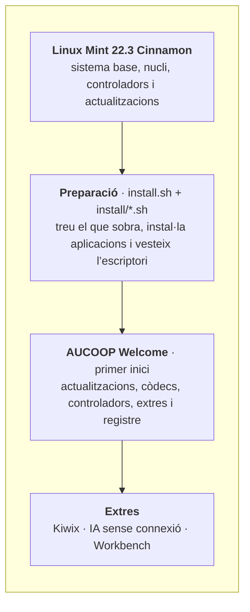
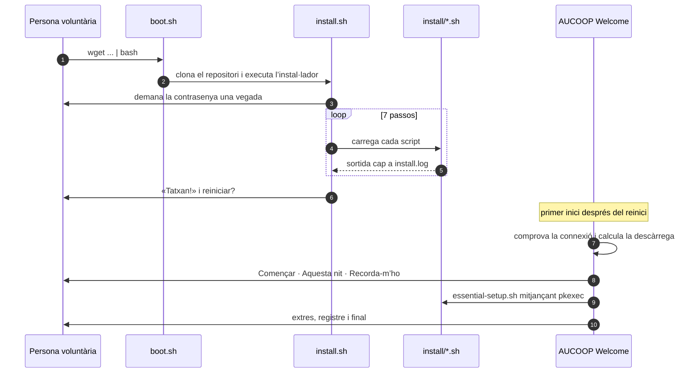

# Arquitectura

AUCOOP Mint és una capa sobre Linux Mint, no pas una bifurcació. Mint s’ocupa de l’instal·lador, el nucli, els controladors i les actualitzacions de seguretat; nosaltres canviem l’aspecte de la màquina i les aplicacions que hi ha instal·lades. Aquí ningú no ha de mantenir una distribució, i el portàtil continua rebent actualitzacions de Mint mentre la sèrie 22.x tingui suport.

## Dos moments

Tot passa mentre prepares el portàtil o durant el primer inici de la persona que el rep. La separació és intencionada: la preparació és ràpida i previsible, mentre que la feina lenta que gasta moltes dades espera fins que algú pugui decidir quan vol fer la descàrrega.

## Per què està construït així

**Scripts de shell, no un sistema de configuració.** Cada pas és un fitxer `.sh` curt i llegible. Una persona voluntària amb coneixements bàsics de Linux pot obrir `install/chrome.sh` i veure exactament què fa. Afegir Ansible o Puppet no aportaria res i costaria una dependència.

**Passos que es poden repetir.** Tot es pot executar dues vegades. És important quan una descàrrega falla a mig camí amb una connexió dolenta, que és una situació habitual i no pas una excepció.

**La feina privilegiada passa per una sola porta.** AUCOOP Welcome no s’executa mai com a root. Quan necessita privilegis crida `pkexec-runner.sh` amb el nom d’una acció i el sistema demana la contrasenya. Afegir una acció privilegiada vol dir afegir-hi un cas, no repartir `sudo` per una aplicació GTK.

**El primer inici no pressuposa internet.** La comprovació arriba abans de qualsevol descàrrega i tots els camins tenen una resposta per a «ara no».

## Components

| Peça | Ubicació | Llenguatge |
|---|---|---|
| Ordre d’arrencada | `boot.sh` | bash |
| Passos de preparació | `install.sh`, `install/` | bash |
| Pantalla de l’instal·lador | `lib/ui.sh`, `lib/logo.sh` | bash |
| Textos de l’instal·lador i Welcome, 5 llengües | `lib/i18n.sh`, `aucoop-welcome/welcome_i18n.py` | bash, Python |
| Aplicació del primer inici | `aucoop-welcome/aucoop_welcome.py` | Python + GTK 3 |
| Accions privilegiades | `aucoop-welcome/pkexec-runner.sh` i scripts relacionats | bash |
| Registre de dispositius | `aucoop-workbench/` (submòdul) | Python |
| Constructor de la ISO de recuperació | `build-iso.sh`, `configs/` | bash |

## Què canvia al sistema

Elimina Firefox, LibreOffice, Thunderbird, Transmission, Seahorse, Hypnotix, Warpinator, Webapp Manager i HexChat.

Afegeix Chrome, OnlyOffice amb llançadors de Word, Excel i PowerPoint, Flathub, AUCOOP Welcome i Workbench.

Configura el tema Mint-Y-Blue, el cursor DMZ-White, el fons i la pantalla d’accés d’AUCOOP, la barra de tasques, la icona del menú i els àlies de cerca. També desactiva la finestra de benvinguda de Mint.

Deixa per al primer inici les actualitzacions, els còdecs, els controladors, Kiwix, l’assistent d’IA i el registre del dispositiu.
