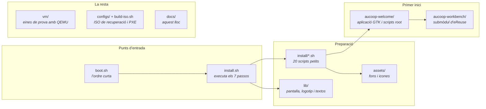

# Mapa del repositori

On és cada cosa quan busques el fitxer que fa una acció concreta.

## Passos de preparació

`install.sh` els agrupa en els set passos que es veuen a la pantalla. Cada fitxer és prou curt per llegir-lo en un minut.

| Script | Funció |
|---|---|
| `remove-apps.sh` | Elimina Firefox, LibreOffice, Thunderbird i la resta |
| `chrome.sh` | Instal·la Chrome i el fa navegador predeterminat |
| `onlyoffice.sh` | Instal·la OnlyOffice i les associacions de fitxers |
| `flathub.sh` | Afegeix Flathub al Gestor de programari |
| `theme.sh`, `cursor.sh`, `wallpaper.sh` | Mint-Y-Blue, DMZ-White, fons i pantalla d’accés d’AUCOOP |
| `software-manager-icon.sh`, `update-manager.sh` | Canvi d’icona i política d’actualitzacions |
| `desktop-shortcuts.sh` | Llançadors de Word, Excel i PowerPoint |
| `panel.sh`, `menu-button.sh`, `menu-cleanup.sh`, `search-aliases.sh` | Barra, botó del menú, neteja i àlies de cerca |
| `branding.sh` | Logotip i avatar de l’usuari |
| `aucoop-workbench.sh`, `aucoop-welcome.sh` | Instal·la totes dues aplicacions a `/opt` |
| `mint-welcome.sh` | Impedeix que la benvinguda de Mint s’obri en iniciar la sessió |
| `codecs.sh`, `drivers.sh` | No formen part de l’execució predeterminada; els fa servir Welcome |

## Aplicació del primer inici

Tot és a `aucoop-welcome/`:

| Fitxer | Funció |
|---|---|
| `aucoop_welcome.py` | Aplicació GTK: cinc passos, connexió i progrés |
| `welcome_i18n.py` | Textos en anglès, castellà, català, francès i portuguès |
| `modules.json` | Extres i models amb sumes, mides i llicències |
| `pkexec-runner.sh` | Única porta cap a root; cada acció és un cas |
| `essential-setup.sh` | Actualitzacions, còdecs i controladors; primer repara instal·lacions incompletes |
| `schedule-setup.sh` | Instal·la el temporitzador de systemd de les 22.00 |
| `remind-when-online.sh` | Espera la xarxa, avisa i torna a obrir Welcome |
| `install-module.sh` | Instal·la un extra de `modules.json` (avui, Kiwix) |
| `install-local-ai.sh` | Descarrega i verifica l’entorn i un model; crea el llançador |
| `uninstall-local-ai.sh` | Elimina l’assistent i allibera espai |
| `run-workbench-registration.sh` | Executa Workbench contra una instància de Devicehub |

## Pantalla de l’instal·lador

| Fitxer | Funció |
|---|---|
| `lib/ui.sh` | Animació, passos, barra, detalls i pantalla d’error |
| `lib/logo.sh` | Logotip en dades de cel·les de mig bloc, generat |
| `lib/make-logo.py` | El regenera des de `assets/AUCOOP_logotip.png` |
| `lib/i18n.sh` | Textos de l’instal·lador en les cinc llengües |

## La resta

`vm/` conté les eines de QEMU que es fan servir a les [proves](../testing/index.md). `configs/` i `build-iso.sh` construeixen una ISO de recuperació basada en Clonezilla. `aucoop-workbench/` és un submòdul git que apunta al [workbench-script d’eReuse](https://github.com/eReuse/workbench-script); recorda `--recurse-submodules` quan clonis.
