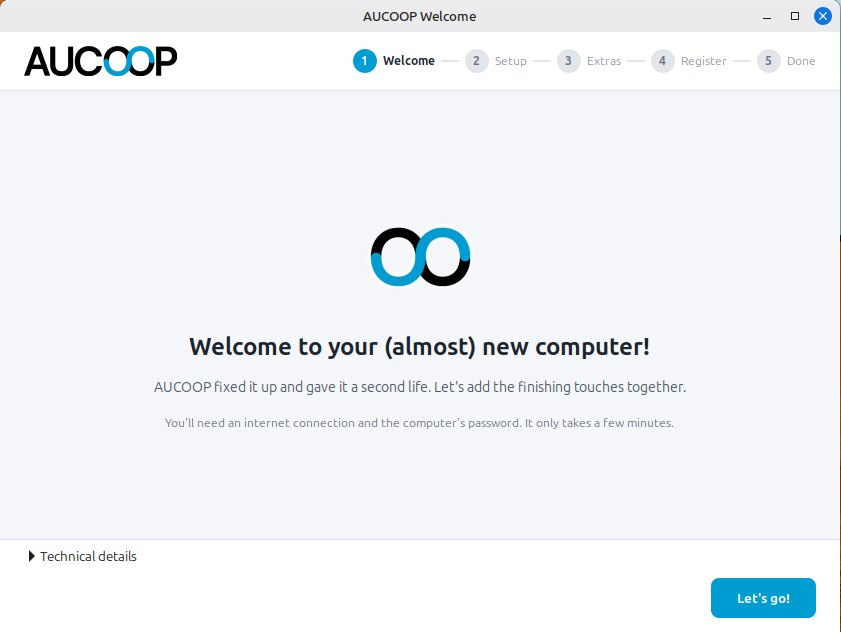
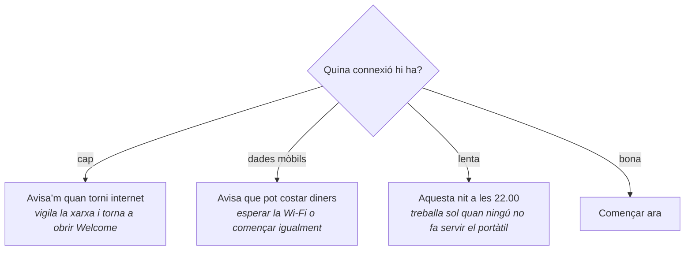
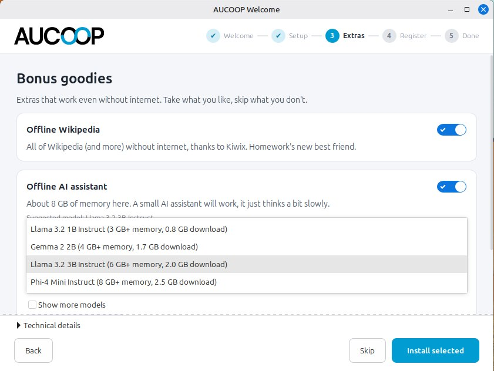
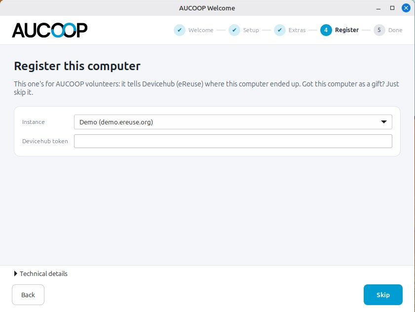

# Primer inici: AUCOOP Welcome

El reinici porta a la pantalla d’accés d’AUCOOP. Inicia la sessió i s’obrirà una finestra:

A dalt hi ha cinc passos. A baix trobaràs els botons per anar enrere o avançar i un plafó plegat de «Detalls tècnics» per a qui vulgui veure les ordres. Pots tancar la finestra quan vulguis; si la preparació no ha acabat, tornarà a obrir-se la pròxima vegada que iniciïs la sessió.

Prem **Som-hi!**. Aquesta primera pàgina no descarrega res.

## Passos 1 i 2: actualitzacions i elements bàsics

Quan avances, Welcome comprova la connexió abans de descarregar res:

La xifra es mesura, no s’inventa. Welcome pregunta a apt quant descarregaria, cronometra una mostra del servidor que conté la major part de les dades i fa el càlcul. La màquina de la captura va trobar uns 400 MB. La quantitat canvia a mesura que la imatge de Mint envelleix i arriben actualitzacions noves.

La proposta depèn de la connexió, una qüestió important a les escoles amb enllaços poc fiables:

Prem **Començar**, escriu la contrasenya i treballarà en tres blocs: actualitzacions de seguretat, còdecs per reproduir vídeo i música, i controladors del maquinari. Cada bloc queda marcat quan acaba. La línia inferior mostra el paquet que s’està instal·lant perquè una actualització llarga no sembli encallada. A sota van apareixent consells per a la persona que farà servir el portàtil.

Fes servir **Omet (sense internet)** si ara només vols recórrer Welcome. El podràs tornar a obrir des de la icona de l’escriptori quan la connexió estigui a punt.

## Pas 3: extres

Activa un dels extres, o tots dos, i prem **Instal·la la selecció**:

Hi ha dues opcions, totes dues útils sense internet:

**Viquipèdia sense connexió** instal·la Kiwix, el lector. El contingut es descarrega a part i una Viquipèdia completa ocupa uns quants gigabytes. Fes aquesta descàrrega amb una bona connexió o copia el fitxer des d’una memòria USB.

**L’assistent d’IA sense connexió** executa un model de llenguatge petit al portàtil. Welcome mesura la memòria i l’espai lliure, només ofereix els models que hi caben, en mostra la llicència i avisa clarament que un assistent petit es pot equivocar. Té una [pàgina pròpia](../use/offline-ai.md).

Obre **Més opcions** per triar el model. Welcome mostra la memòria i la mida de la descàrrega de cadascun i amaga els que aquest ordinador no pot executar:

La màquina de prova de 8 GB ofereix quatre models. Un portàtil més modest veurà una llista més curta. El model suggerit és una bona tria general; escull-ne un de més petit si el temps de descàrrega importa més que la qualitat de les respostes.

També pots ometre tot el pas i tornar-hi més tard des de la icona AUCOOP Welcome de l’escriptori.

## Pas 4: registre

Aquest pas és per al voluntariat d’AUCOOP, no per a la persona que rep el portàtil. Executa [Workbench](https://github.com/eReuse/workbench-script), llegeix el maquinari i el registra a Devicehub per saber on ha anat a parar cada màquina. Cal una instància i un testimoni. Si no els tens, omet el pas.

El testimoni funciona com una contrasenya. No posis mai un testimoni real en una captura, un document o un missatge.

## Pas 5: acabat

L’última pàgina recorda on és cada cosa: Chrome a la barra de tasques, les aplicacions ofimàtiques al costat i els extres instal·lats. Si has aplicat actualitzacions en aquesta sessió, oferirà reiniciar per completar-les.

Quan arribes aquí, Welcome deixa d’obrir-se a l’inici de sessió. La icona es queda a l’escriptori i sempre hi pots tornar amb un doble clic.
