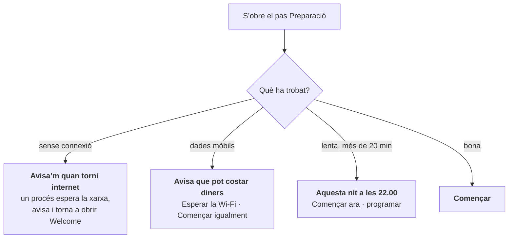

# Internet lent, de pagament o inexistent

Molts d’aquests portàtils acabaran en llocs on la connexió és pitjor que la que tens mentre llegeixes això. Algunes escoles comparteixen el punt d’accés d’un telèfon, d’altres paguen per megabyte i d’altres passen dies sense xarxa. AUCOOP Welcome parteix d’aquesta realitat en comptes de donar per fet que hi ha un cable ràpid.

## Indica el cost abans de gastar dades

Abans de començar les actualitzacions, Welcome pregunta a apt quant descarregaria, cronometra uns quants megabytes del servidor que conté la major part de les dades i mostra totes dues xifres:

> Uns 600 MB per descarregar, uns 12 min amb aquesta connexió.

No descarrega res fins que prems Començar.

## Quatre situacions, quatre propostes

**Sense connexió.** El recordatori engega un petit vigilant en segon pla. Quan torna internet, apareix una notificació i Welcome es torna a obrir comprovant ja la connexió. La preparació també continua a l’inici automàtic i reapareix en iniciar la sessió encara que l’avís no arribi.

**Dades mòbils.** NetworkManager sap si una connexió és de consum mesurat i Welcome trasllada l’avís: la descàrrega pot costar diners. «Esperar la Wi-Fi» engega el mateix vigilant, però aquesta vegada espera una connexió que no sigui de pagament.

**Lenta.** Si l’estimació supera els vint minuts, Welcome ofereix treballar a les 22.00, quan ningú no fa servir el portàtil.

**Bona.** Només cal prémer Començar.

## Com funciona l’execució nocturna

Triar «Aquesta nit a les 22.00» demana la contrasenya una vegada i instal·la un temporitzador de systemd:

- Si el portàtil és apagat a les 22.00, la feina es farà la pròxima vegada que s’engegui.
- Manté la màquina desperta mentre descarrega i la desperta de la suspensió quan el maquinari ho permet.
- Quan acaba correctament, esborra el temporitzador. Si falla, ho torna a provar la nit següent.
- Al matí, Welcome diu: «L’ordinador ha fet els deures aquesta nit. Tot al dia!»

Deixa el portàtil endollat. Una actualització nocturna d’apt amb bateria pot deixar el sistema a mig instal·lar.

## Talls de corrent

La preparació comença acabant el que una execució anterior va deixar a mitges (`dpkg --configure -a` i `apt-get install -f`). Així, un portàtil que s’ha apagat durant una actualització es repara en l’intent següent sense necessitar un terminal.

## Les descàrregues grans es reprenen

El model d’IA és la descàrrega grossa, fins a 9 GB. Si la connexió cau, l’intent següent continua on s’havia quedat, ho torna a provar tot sol i comprova el fitxer acabat amb la seva suma de verificació. L’entorn d’execució de 370 MB només es torna a descarregar quan en canvia la versió.

## Què falta encara

No hi ha cap memòria cau compartida. Preparar trenta portàtils en un taller descarrega el mateix trenta vegades. Un `apt-cacher-ng` local a l’ordinador d’una persona voluntària, o una memòria USB amb els `.deb`, els models i els arxius `.zim`, ho resoldria. És a la llista.
