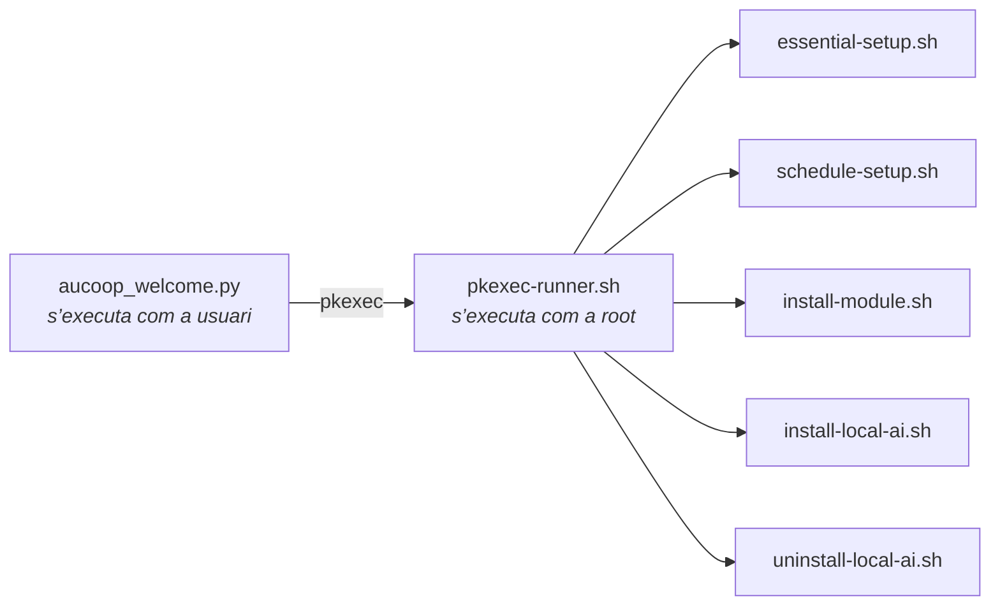

# Referència tècnica

Detalls que no encaixen a les pàgines d’ús quotidià.

## Principis de disseny

**Menys és més.** Cada aplicació fixada és una aplicació que la persona receptora farà servir. Traiem la resta perquè un menú amb quaranta entrades és pitjor que un amb vuit per a algú que no ha utilitzat mai Linux.

**Ha de funcionar en maquinari antic.** Alguns portàtils tenen dotze anys, 4 GB de memòria i un disc mecànic. Això descarta escriptoris pesants i explica per què l’assistent d’IA comprova la memòria abans d’oferir un model.

**Els hàbits de Windows serveixen.** Barra a baix, menú a la cantonada inferior esquerra, Word i Excel on s’esperen. Aquí pesa més allò que és familiar que no pas l’elegància.

## Per què Linux Mint

| | Windows | Ubuntu (GNOME) | Linux Mint (Cinnamon) |
|---|---|---|---|
| Lliure i gratuït | no | sí | sí |
| Funciona en un portàtil del 2012 | malament | prou bé | sí |
| Familiar per a qui fa servir Windows | sí | no gaire | sí |
| Suport a llarg termini | sí | sí | sí, segueix Ubuntu LTS |

Mint 22.x segueix Ubuntu 24.04 LTS, amb suport fins al 2029. Mint 23 no està previst fins al desembre del 2026, així que no hi ha pressa.

## Canvis de la preparació

**Eliminat:** firefox, libreoffice-*, thunderbird, hexchat, element-desktop, matrix-synapse, mintchat, warpinator, webapp-manager, transmission-gtk, seahorse, hypnotix.

**Instal·lat:** google-chrome-stable, onlyoffice-desktopeditors, flatpak amb el remot Flathub i les dependències de Workbench: smartmontools, lshw, hwinfo, dmidecode, inxi, qrencode i pciutils.

**Configuració de l’escriptori:**

| Ajust | Valor |
|---|---|
| Tema GTK i icones | Mint-Y-Blue |
| Cursor | DMZ-White |
| Fons i pantalla d’accés | marca AUCOOP |
| Barra de tasques | Chrome, Fitxers, Word, Excel, PowerPoint, Gestor de programari |
| Àlies de cerca | «app store» i «download» troben el Gestor de programari |
| Benvinguda de Mint | desactivada amb `~/.linuxmint/mintwelcome/norun.flag` |

Els llançadors ofimàtics són fitxers `.desktop` a `~/.local/share/applications/`, anomenats Word, Excel i PowerPoint. Cadascun obre OnlyOffice amb l’argument `--new:` corresponent.

## Root i com es demana

L’instal·lador demana els privilegis una vegada amb `sudo -v` i manté viva l’autorització durant tota l’execució. AUCOOP Welcome funciona com a usuari i no crida mai `sudo`: totes les accions privilegiades passen per un únic script, de manera que el sistema mostra el seu propi diàleg de contrasenya.



Per afegir una acció privilegiada només cal afegir un cas a `pkexec-runner.sh`.

## Tasques del primer inici

`essential-setup.sh` fa, per ordre: reparar una instal·lació interrompuda, `apt-get update`, `apt-get upgrade`, instal·lar `mint-meta-codecs` i executar `ubuntu-drivers autoinstall`. Enregistra el final a `/var/lib/aucoop-welcome/essential-setup-complete`; així Welcome sap l’endemà que una execució nocturna ha acabat sense cap sessió oberta.

Welcome analitza la sortida d’apt per mostrar el progrés («Setting up 29 of 431 · libmount1»). `pkexec` neteja la configuració regional, de manera que apt escriu en anglès sigui quina sigui la llengua de l’escriptori i l’anàlisi es manté estable.

## IA sense connexió

`modules.json` conté la llista de models. Cada entrada inclou URL, nom, SHA-256, mida exacta, memòria mínima, llicència i enllaç a la llicència. L’entorn llamafile també hi està fixat, actualment a la versió 0.10.6.

La instal·lació es nega aviat si falta memòria (amb mig gigabyte de tolerància, perquè un portàtil «de 8 GB» n’informa uns 7,8) o espai de disc. A més, reserva un deu per cent perquè la unitat no quedi plena. Les descàrregues es reprenen, ho tornen a provar i es verifiquen amb SHA-256 abans de rebre el nom definitiu.

El llançador generat espera que el servidor respongui abans d’obrir el navegador, fa servir el port lliure següent si el 8091 és ocupat i inicia un vigilant que atura el model al cap de deu minuts sense cap navegador connectat.

## Llengües

Cinc: anglès, castellà, català, francès i portuguès. L’instal·lador llegeix `lib/i18n.sh`; Welcome llegeix `welcome_i18n.py`. Tots dos trien la llengua de `LANGUAGE`, `LC_ALL`, `LC_MESSAGES` o `LANG`, per aquest ordre. Per fer proves, es pot forçar amb `AUCOOP_LANG=fr`.

El portuguès fa servir formes europees (*ecrã*, *palavra-passe*, *transferir*), que són les habituals a Angola i Moçambic.

## Registres

| Què | On |
|---|---|
| Preparació | `~/.local/state/aucoop-mint/install.log` |
| Ordres de Welcome | plafó «Detalls tècnics», en directe |
| Execució nocturna | `/var/log/aucoop-essential-setup.log` |
| Assistent d’IA | `/tmp/aucoop-local-ai.log` |

## Maneres de desplegar

**Un portàtil:** instal·lar Mint, executar l’ordre, acabar amb Welcome i lliurar-lo.

**Un lot:** preparar una màquina, capturar-la amb Clonezilla i restaurar les altres. És més ràpid i evita necessitar internet a cadascuna. Els clons comparteixen nom de màquina, machine-id i claus SSH; restableix-los o prepara la màquina de referència amb el mode OEM de Mint perquè cada persona creï el seu compte al primer inici.

**ISO de recuperació:**

```bash
sudo apt install squashfs-tools xorriso syslinux-common isolinux clonezilla drbl partclone
sudo ./build-iso.sh /path/to/clonezilla-image /path/to/debian-live-for-ocs.iso /path/to/output.iso
```

**Per xarxa:** PXE, documentat al [Community Network Handbook](https://github.com/aucoop/Community-Network-Handbook).

## Imatge de referència

Linux Mint 22.3 «Zena» Cinnamon de 64 bits. Una instal·lació preparada ocupa uns 12 GB al disc, aproximadament 3,6 GB comprimida. El compte `aucoop` / `aucoop` és una convenció de proves; fes servir una contrasenya raonable a les màquines que surtin del taller.

## Llicència

Els scripts i la configuració tenen llicència MIT. Linux Mint, Chrome, OnlyOffice, Kiwix, llamafile i els models mantenen les seves llicències; Welcome mostra la del model abans d’instal·lar-lo.
