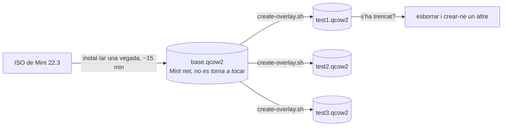

# Proves en una màquina virtual

No provis mai la preparació al portàtil que estàs a punt de lliurar. Fes servir QEMU amb discos superposats: instal·la Mint una vegada en una imatge base i crea còpies d’un sol ús per a cada prova.



Una imatge superposada només desa els canvis. Crear-ne una de nova triga un segon i gairebé no ocupa disc.

## Preparació inicial

```bash
./vm/create-base-disk.sh ~/vms/mint-base.qcow2 40G
./vm/install-mint.sh ~/Downloads/linuxmint-22.3-cinnamon-64bit.iso ~/vms/mint-base.qcow2
```

Instal·la Mint amb normalitat a la finestra. Crea l’usuari `aucoop` amb la contrasenya `aucoop` (només per a màquines de prova) i instal·la el servidor SSH després del primer inici:

```bash
sudo apt install openssh-server
```

Apaga la màquina virtual i no tornis a tocar la imatge base.

## Cada prova

```bash
./vm/create-overlay.sh ~/vms/mint-base.qcow2 ~/vms/test.qcow2
./vm/run-overlay.sh ~/vms/test.qcow2 2222
```

Copia l’arbre de treball i executa l’instal·lador com ho faria una persona voluntària:

```bash
sshpass -p aucoop scp -P 2222 -r . aucoop@127.0.0.1:/home/aucoop/.aucoop-mint
sshpass -p aucoop ssh -t -p 2222 aucoop@127.0.0.1 'cd ~/.aucoop-mint && bash install.sh'
```

Fes servir `ssh -t`. L’instal·lador demana una contrasenya i dibuixa al terminal. Sense pseudoterminal provaries la sortida senzilla d’emergència, no pas el que veu la persona usuària.

Després elimina la imatge superposada:

```bash
rm ~/vms/test.qcow2
```

## Coses que convé saber

**Comprova els canvis de l’escriptori després de reiniciar.** Cinnamon reescriu part de la configuració quan es tanca la sessió; els canvis del plafó i del tema només es veuen bé després de reiniciar la màquina virtual i tornar a iniciar la sessió.

**Obre AUCOOP Welcome des de la icona, no per SSH.** Les accions privilegiades passen per `pkexec`, que necessita que l’aplicació pertanyi a la sessió gràfica. Si s’engega per SSH, prova de demanar una contrasenya en un terminal que no existeix i falla per un motiu que no té res a veure amb el canvi.

**Les captures funcionen sense una finestra local.** `xdotool` i `scrot`, amb `DISPLAY=:0`, permeten recórrer tota la interfície des d’un script. Així es van fer les captures d’aquesta documentació.

**Compte amb `pkill -f`.** Un patró com `/opt/aucoop-ai/` també coincideix amb la teva pròpia ordre SSH si esmenta aquest camí i mata la sessió. Ho sabem per experiència.

## Per què no fem servir una imatge de núvol

Mint no en publica cap, i tampoc no ajudaria: gairebé tot el que fa AUCOOP Mint toca Cinnamon, dconf, fitxers d’escriptori i temes d’icones, elements que no existeixen en una imatge de servidor sense interfície. Fes servir la ISO real.
