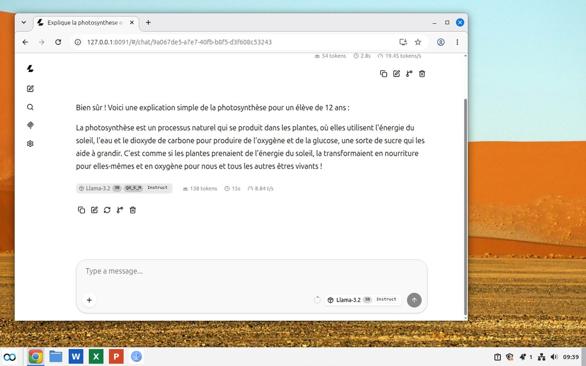
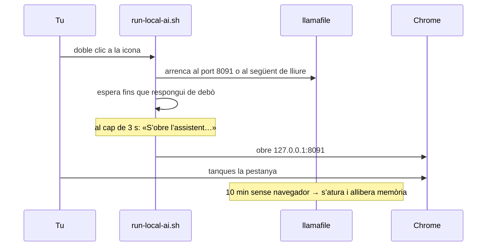

# L’assistent d’IA sense connexió

Prem la icona blava i s’obrirà una pàgina de xat al navegador. Fes una pregunta i la resposta sortirà del mateix portàtil, no d’un servidor:



No cal cap compte ni internet, i no s’envia res enlloc. El model és a `/opt/aucoop-ai` i escolta a `127.0.0.1`, de manera que només hi pot accedir aquell ordinador.

## Per a què serveix i per a què no

Explicar un concepte, preparar una carta, traduir una frase o ajudar amb un exercici de matemàtiques: aquí és on un model petit és útil, sobretot sense connexió.

Els fets són una altra història. Aquests models són cent vegades més petits que els d’un servei de xat en línia i s’inventen respostes amb tota la seguretat del món. A les proves, l’antic model predeterminat (Qwen2.5 0.5B) va afirmar que la fotosíntesi passa en «plantes i animals» i va repetir Àsia a la llista de continents. Per això Welcome avisa a la mateixa targeta que la Viquipèdia és més segura per consultar fets, i per això vam eliminar els models més petits.

## Quin model va a cada portàtil

Welcome mesura la memòria i l’espai lliure, i només ofereix el que la màquina pot executar:


| Memòria | Model | Descàrrega | Llicència |
|---|---|---|---|
| 3 GB o més | Llama 3.2 1B | 0,8 GB | Llama 3.2 Community |
| 4 GB o més | Gemma 2 2B | 1,7 GB | Condicions de Gemma |
| 6 GB o més | Llama 3.2 3B | 2,0 GB | Llama 3.2 Community |
| 8 GB o més | Phi-4 Mini | 2,5 GB | MIT |
| 16 GB o més | Qwen3 8B | 5,0 GB | Apache 2.0 |
| 24 GB o més | Qwen3 14B | 9,0 GB | Apache 2.0 |

Més gran vol dir millor i també més lent. En una màquina de prova amb 8 GB, Llama 3.2 3B va respondre una pregunta de dues frases en francès en uns 15 segons, a gairebé 9 paraules per segon. En un portàtil antic de dos nuclis pot trigar entre tres i cinc vegades més. Encara és útil per a un paràgraf, però no per a una conversa ràpida.

La llicència apareix al costat del model amb un enllaç a la seva pàgina. Instal·lar-lo implica acceptar aquestes condicions.

## Què passa quan prems la icona



Aquest últim pas importa en un portàtil de 4 GB: el model ocupa tota la seva mida a la memòria mentre funciona. Deixar-lo carregat gastaria una quarta part de la màquina. Torna a prémer la icona quan el vulguis engegar.

## Desinstal·lar-lo

Obre AUCOOP Welcome, ves a Extres i prem Elimina. Atura l’assistent, esborra el model i l’entorn, treu les icones i recupera entre 0,8 i 9,4 GB segons el model.

## Per dins

L’entorn d’execució és [llamafile](https://github.com/mozilla-ai/llamafile), fixat a la versió 0.10.6. Tant aquest fitxer com cada model es comproven amb SHA-256 abans d’instal·lar-se. Si una descàrrega represa no coincideix amb la suma, es descarta en comptes d’instal·lar un fitxer malmès; és la mena de problema que només apareix amb connexions dolentes i és terrible de depurar.

La pàgina de xat és la interfície web de llamafile. Al mateix port també hi ha una API compatible amb OpenAI:

```bash
curl -s http://127.0.0.1:8091/v1/chat/completions \
  -H 'Content-Type: application/json' \
  -d '{"messages":[{"role":"user","content":"Quina és la capital de Moçambic?"}]}'
```
