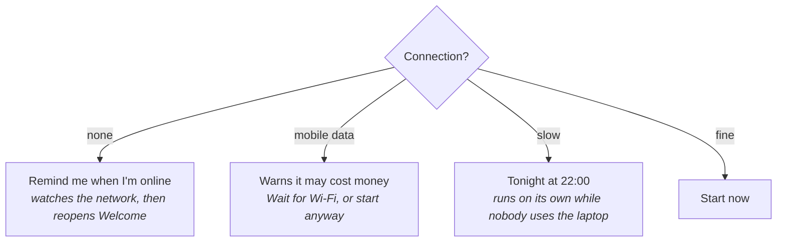

# First login: AUCOOP Welcome

The restart lands on the AUCOOP login screen. Log in, and a window opens on its own:

Five steps across the top, Back and Next at the bottom, and a collapsed "Technical details" panel for anyone who wants to watch the commands. You can close the window at any point; if setup hasn't finished, it comes back at the next login.

Click **Let's go!**. Nothing downloads on this first page.

## Step 1 and 2: updates and the essentials

Click through the welcome page and Welcome checks the connection before downloading anything:

That line is measured, not guessed. It asks apt what it would download, times a sample from the mirror that carries most of the bytes, and does the arithmetic. The test machine in the screenshot found about 400 MB. Expect the number to change as the Mint ISO gets older and new updates arrive.

What happens next depends on the connection, and this is the part worth knowing if you work with schools on bad links:

Press Start, type the password, and it works through three things: security updates, then the codecs that make video and music play, then hardware drivers. Each one ticks off as it goes, and the line underneath names the package it's installing right now, so a long upgrade doesn't look like a frozen spinner. There are tips rotating below it, aimed at whoever ends up using the laptop.

Use **Skip (no internet)** if you only want to look through Welcome now. You can reopen it from the desktop when the connection is ready.

## Step 3: extras

Turn on either extra, or both, then click **Install selected**:

Two optional things, both useful without internet:

**Offline Wikipedia** installs Kiwix, the reader. The content itself is a separate download, and a full Wikipedia is several gigabytes, so plan that on a good connection or copy the file from a USB stick.

**The offline AI assistant** runs a small language model on the laptop. Welcome measures the memory and the free disk and only offers models the machine can actually handle, shows which licence the model comes with, and says plainly that small assistants get things wrong. It has [its own page](../use/offline-ai.md).

Open **More options** to choose the AI model. Welcome shows the memory and download size for each one and hides models this computer can't run:

The 8 GB test machine in the screenshot can choose between four models. A weaker laptop gets a shorter list. The suggested model is a sensible default; pick a smaller one if download time matters more than answer quality.

You can skip this step entirely and come back from the AUCOOP Welcome desktop icon later.

## Step 4: registration

This step is for AUCOOP volunteers, not for whoever receives the laptop. It runs [Workbench](https://github.com/eReuse/workbench-script), reads the hardware, and files it in Devicehub so we know where each machine ended up. You need an instance and a token. If you don't have one, skip it.

The token works like a password. Don't put a real token in a screenshot, document or chat message.

## Step 5: done

The last page lists where things are: Chrome in the taskbar, the office apps beside it, and the extras you installed. If the updates ran in this session, it offers a restart to finish them.

Once you reach this page, Welcome stops opening at login. The desktop icon stays, so it's always one double-click away.
