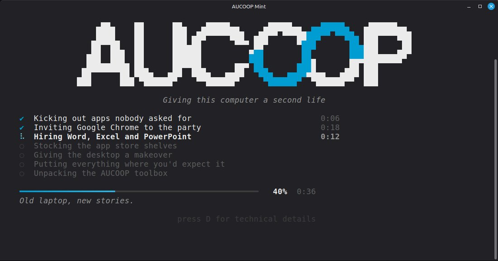
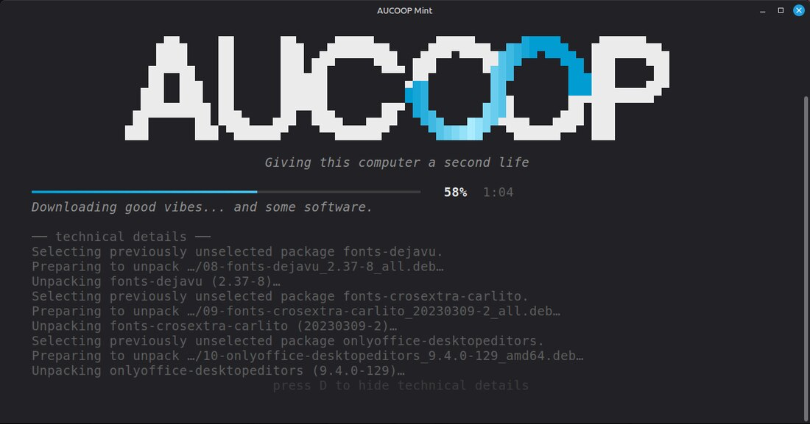
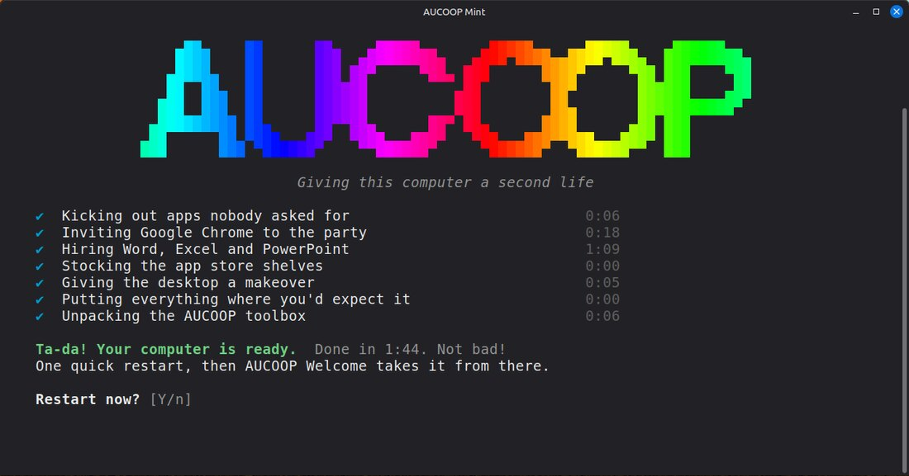

# Prepare a laptop

Start with a laptop that has Linux Mint 22.3 Cinnamon freshly installed, nothing else. You'll need the password of the user account and an internet connection. Give yourself half an hour; most of it is waiting for downloads.

## 1. Install Linux Mint

Nothing special here: the normal Mint installer, from a USB stick.

Two choices during that install matter later. The language you pick becomes the language AUCOOP Mint speaks, so if the laptop is going to a school in Mozambique, choose Portuguese now. And you can leave the "multimedia codecs" box unticked, because AUCOOP Welcome installs those later anyway.

## 2. Run one command

Open a terminal on the freshly installed machine and paste this:

```bash
wget -qO- https://raw.githubusercontent.com/aucoop/AUCOOP-Mint/master/boot.sh | bash
```

This is what it should look like before you press **Enter**:


It asks for the computer's password once. The cursor won't move while you type it; Linux doesn't show the password, not even as dots. Press **Enter** when you're done.

The installer then takes over:



There are seven steps, each with its own timer. A clean test machine took 1 minute 44 seconds; an old laptop or a slow connection will take longer. OnlyOffice is usually the slow part because it's a large download.

If you want to see the actual commands, press **D** at any point:



Press **D** again to return to the simple view. The installer writes the same output to `~/.local/state/aucoop-mint/install.log`, whether the panel is open or closed.

When it finishes it asks whether to restart:



Press **Enter** to accept the default, **Y**, and restart. The new desktop appears after that reboot.

### Prefer to clone it?

```bash
git clone https://github.com/aucoop/AUCOOP-Mint.git
cd AUCOOP-Mint
git submodule update --init --recursive
bash install.sh
```

Same thing; the one-liner just does the cloning for you. Add `--verbose` if you'd rather watch raw output than the progress screen.

## 3. Finish in AUCOOP Welcome

After the restart you log in and AUCOOP Welcome opens by itself with five steps: welcome, setup, extras, registration and done. That's the [next page](first-boot.md).

## What the command actually changes

Removed: Firefox, LibreOffice, Thunderbird, Transmission, Hypnotix, Warpinator and a few other things nobody on a shared school laptop opens.

Installed: Google Chrome, OnlyOffice with launchers named Word, Excel and PowerPoint, and Flathub wired into the Software Manager.

Changed: the theme, the wallpaper, the cursor, the taskbar with its pinned apps, the menu button, and Mint's own welcome window, which we switch off so two welcome screens don't fight at first login.

Left for later: system updates, codecs, drivers and the optional extras, all handled by AUCOOP Welcome so you can decide when to spend the bandwidth.

## Running it twice is fine

The installer is safe to repeat. Steps that are already done get skipped or redone harmlessly, so if something failed halfway, or you're not sure whether it finished, just run the same command again.

## If it fails

The failure screen names the step that broke, tells you what usually causes it, and prints the last lines of the log. Nine times out of ten it's the network. See [Troubleshooting](../troubleshooting.md) for the cases we've actually hit.

## Requirements, briefly

Linux Mint 22.x Cinnamon, a working internet connection, and you running as the normal desktop user. Not root: the script refuses, because half of what it does writes into your own desktop settings.
