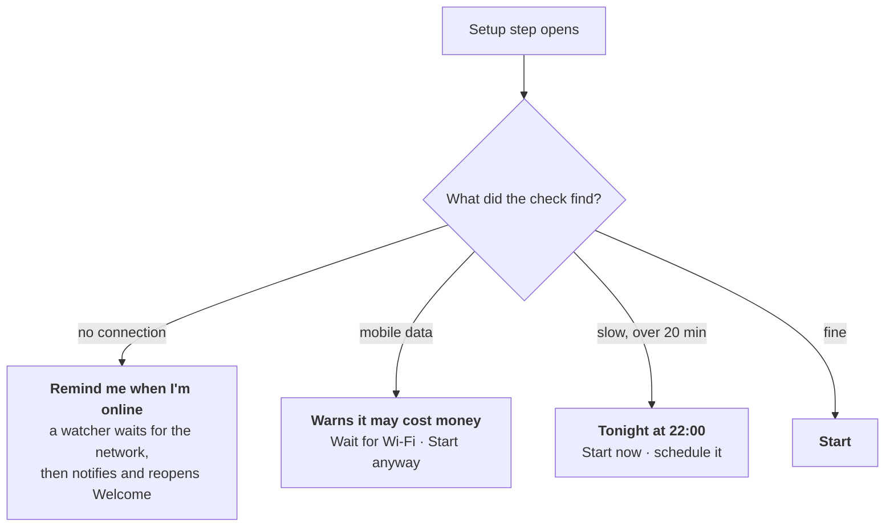

# Slow, paid or missing internet

Most of these laptops end up somewhere the connection is worse than wherever you're reading this. Some schools share a phone hotspot; some pay per megabyte; some have nothing for days. AUCOOP Welcome is built around that instead of assuming a cable.

## It tells you the cost before spending it

Before the updates start, Welcome asks apt exactly what it would download, times a few megabytes from the mirror that carries most of the bytes, and shows both numbers:

> About 600 MB to download, about 12 min at your speed.

Nothing is downloaded until you press Start.

## Four situations, four offers

**No connection.** Picking the reminder starts a small background watcher. When the laptop gets online again, a notification appears and Welcome comes back by itself, already rechecking the connection. Setup also stays in the autostart list, so it reappears at the next login regardless.

**Mobile data.** NetworkManager knows whether a connection is metered, and Welcome passes that on: the download may cost real money. Choosing "Wait for Wi-Fi" starts the same watcher, this time waiting for a connection that isn't metered.

**Slow.** If the estimate crosses twenty minutes, Welcome offers to do it tonight at 22:00 instead, when nobody is using the machine.

**Fine.** Just Start.

## How the night run works

Choosing "Tonight at 22:00" asks for the password once, then installs a systemd timer. What it does for you:

- If the laptop is switched off at 22:00, the work happens the next time it's switched on, rather than never.
- It keeps the machine awake while it downloads, and wakes it from sleep where the hardware supports that.
- Once it succeeds, it deletes its own timer. After a failure it tries again the next night.
- The next morning, Welcome says: "The computer did its homework overnight. All up to date!"

Leave the laptop plugged in. An overnight `apt upgrade` on battery is how you end up with a half-installed system.

## Power cuts

Setup starts by finishing anything a previous run left half-installed (`dpkg --configure -a` and `apt-get install -f`), so a laptop that lost power mid-upgrade repairs itself the next time instead of needing a terminal.

## Large downloads resume

The AI model is the big one, up to 9 GB. If the connection dies, the next attempt continues from where it stopped rather than starting again, retries on its own, and verifies the finished file against its checksum. The 370 MB runtime is only downloaded when its version changes.

## What we still don't do

There's no shared cache yet, so preparing thirty laptops in a workshop downloads everything thirty times. A local `apt-cacher-ng` on one volunteer machine, or a USB stick with the `.deb` files, models and `.zim` archives, would fix that. It's on the list.
