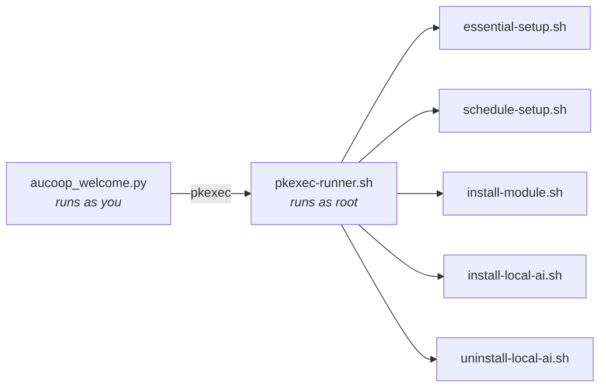

# Technical reference

Details that don't belong on the pages people actually read.

## Design principles

**Less is more.** Every app on the taskbar is one the recipient will use. Everything else gets removed, because a menu with forty entries is worse than one with eight for someone who's never used Linux.

**It has to run on old hardware.** Some of these laptops are twelve years old with 4 GB of memory and a spinning disk. That rules out heavy desktop environments, and it's why the AI assistant checks memory before offering a model.

**Windows habits carry over.** Taskbar at the bottom, menu button bottom-left, Word and Excel where you'd expect them. Familiar beats elegant here.

## Why Linux Mint

| | Windows | Ubuntu (GNOME) | Linux Mint (Cinnamon) |
|---|---|---|---|
| Free and open | no | yes | yes |
| Runs on a 2012 laptop | badly | reasonably | yes |
| Familiar to a Windows user | yes | not really | yes |
| Long-term support | yes | yes | yes, follows Ubuntu LTS |

Mint 22.x follows Ubuntu 24.04 LTS, supported until 2029. Mint 23 isn't due until December 2026, so there's no rush.

## What provisioning changes

**Removed:** firefox, libreoffice-*, thunderbird, hexchat, element-desktop, matrix-synapse, mintchat, warpinator, webapp-manager, transmission-gtk, seahorse, hypnotix.

**Installed:** google-chrome-stable, onlyoffice-desktopeditors, flatpak plus the Flathub remote, and the Workbench dependencies: smartmontools, lshw, hwinfo, dmidecode, inxi, qrencode, pciutils.

**Desktop settings:**

| Setting | Value |
|---|---|
| GTK and icon theme | Mint-Y-Blue |
| Cursor | DMZ-White |
| Wallpaper and login background | AUCOOP branded |
| Taskbar | Chrome, Files, Word, Excel, PowerPoint, Software Manager |
| Menu search aliases | "app store", "download" find the Software Manager |
| Mint Welcome | disabled via `~/.linuxmint/mintwelcome/norun.flag` |

The office launchers are `.desktop` files in `~/.local/share/applications/` named Word, Excel and PowerPoint, each opening OnlyOffice with the matching `--new:` argument.

## Root, and how we ask for it

The installer asks once with `sudo -v` and keeps the timestamp alive in the background for the whole run. AUCOOP Welcome, which runs as your user, never calls `sudo`: every privileged action goes through one script, so the system shows its own password dialog.



Adding a privileged action means adding a case to `pkexec-runner.sh`, nothing else.

## First-boot tasks

`essential-setup.sh`, in order: repair anything a power cut left half-installed, `apt-get update`, `apt-get upgrade`, install `mint-meta-codecs`, then `ubuntu-drivers autoinstall`. It records completion in `/var/lib/aucoop-welcome/essential-setup-complete` so a run that happened overnight, with nobody logged in, is visible to Welcome the next morning.

Welcome parses apt's own output to show progress ("Setting up 29 of 431 · libmount1"). Under `pkexec` the locale is cleared, so apt prints in English regardless of the desktop language, which keeps that parsing stable.

## The offline AI

`modules.json` holds the model list. Each entry carries a URL, filename, SHA-256, exact size in bytes, minimum memory, licence and licence URL. The llamafile runtime is pinned there too, currently 0.10.6.

Installation refuses early if the machine lacks the memory (with half a gigabyte of tolerance, since an "8 GB" laptop reports about 7.8) or the disk space, including a tenth on top so the disk doesn't end up completely full. Downloads resume, retry, and are checked against their SHA-256 before being renamed into place.

The generated launcher waits for the server to answer before opening the browser, moves to the next free port if 8091 is taken, and starts a watchdog that stops the model after ten minutes without a browser connection.

## Languages

Five: English, Spanish, Catalan, French, Portuguese. The installer reads `lib/i18n.sh`, Welcome reads `welcome_i18n.py`, and both pick the language from `LANGUAGE`, `LC_ALL`, `LC_MESSAGES` or `LANG`, in that order. Force one with `AUCOOP_LANG=fr` for testing.

Portuguese uses European forms (*ecrã*, *palavra-passe*, *transferir*), which is what Angola and Mozambique use.

## Logs

| What | Where |
|---|---|
| Provisioning | `~/.local/state/aucoop-mint/install.log` |
| Welcome's commands | the "Technical details" panel, live |
| Scheduled night run | `/var/log/aucoop-essential-setup.log` |
| AI assistant | `/tmp/aucoop-local-ai.log` |

## Deployment workflows

**One laptop:** install Mint, run the one-liner, finish in Welcome, hand it over.

**A batch:** prepare one machine, capture it with Clonezilla, restore onto the others. Faster, and it needs no internet on each machine. Remember that clones share a hostname, machine-id and SSH host keys; reset those, or prepare the reference machine with Mint's OEM mode so each recipient sets up their own account at first boot.

**Recovery ISO:**

```bash
sudo apt install squashfs-tools xorriso syslinux-common isolinux clonezilla drbl partclone
sudo ./build-iso.sh /path/to/clonezilla-image /path/to/debian-live-for-ocs.iso /path/to/output.iso
```

**Over the network:** PXE, documented in the [Community Network Handbook](https://github.com/aucoop/Community-Network-Handbook).

## Reference image

Linux Mint 22.3 "Zena" Cinnamon, 64-bit. A provisioned install sits around 12 GB on disk, roughly 3.6 GB compressed. The `aucoop` / `aucoop` account is a testing convention; use something sensible on machines that leave the workshop.

## Licence

The scripts and configuration are MIT. Linux Mint, Chrome, OnlyOffice, Kiwix, llamafile and the language models keep their own licences; the model licence is shown in Welcome before you install one.
