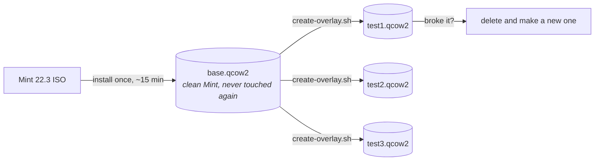

# Testing in a VM

Never test provisioning on the laptop you're about to give away. Use QEMU with overlay disks: install Mint once into a base image, then throw disposable copies at it.



An overlay only stores what changed, so making a fresh one takes a second and costs almost no disk.

## Set it up once

```bash
./vm/create-base-disk.sh ~/vms/mint-base.qcow2 40G
./vm/install-mint.sh ~/Downloads/linuxmint-22.3-cinnamon-64bit.iso ~/vms/mint-base.qcow2
```

Install Mint normally in the window that opens. Create the user `aucoop` with password `aucoop` (test machines only, obviously), and once it boots, install the SSH server so you can drive it from a terminal:

```bash
sudo apt install openssh-server
```

Then shut the VM down and leave that image alone.

## Each test run

```bash
./vm/create-overlay.sh ~/vms/mint-base.qcow2 ~/vms/test.qcow2
./vm/run-overlay.sh ~/vms/test.qcow2 2222
```

Copy the working tree in and run the installer as if you were a volunteer:

```bash
sshpass -p aucoop scp -P 2222 -r . aucoop@127.0.0.1:/home/aucoop/.aucoop-mint
sshpass -p aucoop ssh -t -p 2222 aucoop@127.0.0.1 'cd ~/.aucoop-mint && bash install.sh'
```

Use `ssh -t`. The installer asks for a password and draws to the terminal, so without a pseudo-terminal you'll be testing the plain fallback path instead of what users see.

Throw the overlay away afterwards:

```bash
rm ~/vms/test.qcow2
```

## Things worth knowing

**Test desktop changes after a reboot.** Cinnamon rewrites parts of its configuration when the session ends, so panel and theme changes only show up properly once you restart the VM and log in again.

**Run AUCOOP Welcome from the desktop icon, not over SSH.** Anything privileged goes through `pkexec`, which needs the app to belong to the graphical session. Started over SSH it falls back to asking for a password on a terminal that isn't there, and fails in a way that has nothing to do with your change.

**Screenshots work headless.** `xdotool` and `scrot` with `DISPLAY=:0` let you click through the whole flow from a script, which is how the screenshots in these docs were made.

**Beware `pkill -f`.** A pattern like `/opt/aucoop-ai/` also matches your own SSH command line if it happens to mention that path, and kills your session. Ask us how we know.

## Why not a cloud image

Mint doesn't publish one, and it wouldn't help: most of what AUCOOP Mint does touches Cinnamon, dconf, desktop files and icon themes, none of which exist on a headless server image. Use the real ISO.
