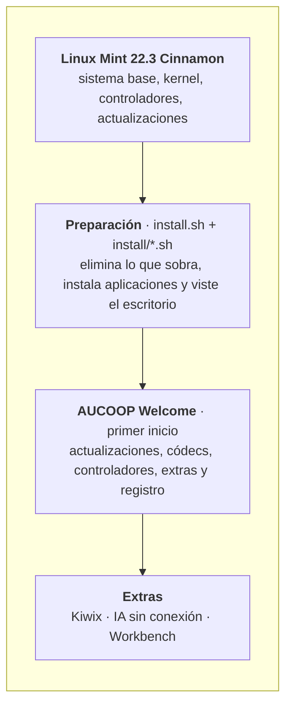
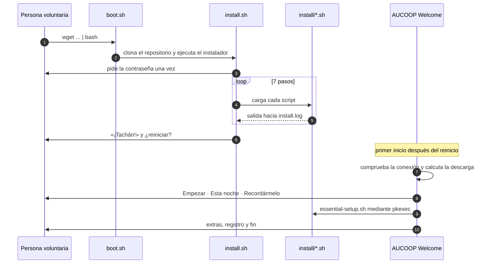

# Arquitectura

AUCOOP Mint es una capa sobre Linux Mint, no una bifurcación. Mint se ocupa del instalador, el kernel, los controladores y las actualizaciones de seguridad; nosotros cambiamos el aspecto de la máquina y las aplicaciones instaladas. Nadie tiene que mantener aquí una distribución, y el portátil seguirá recibiendo actualizaciones de Mint mientras la serie 22.x tenga soporte.

## Dos momentos

Todo sucede mientras preparas el portátil o durante el primer inicio de la persona que lo recibe. La separación es intencionada: la preparación es rápida y predecible; el trabajo lento que consume muchos datos espera hasta que alguien pueda decidir cuándo hacer la descarga.

## Por qué está construido así

**Scripts de shell, no un sistema de configuración.** Cada paso es un archivo `.sh` corto y legible. Una persona con conocimientos básicos de Linux puede abrir `install/chrome.sh` y ver qué hace. Ansible o Puppet no aportarían nada aquí y añadirían una dependencia.

**Pasos que se pueden repetir.** Todo admite una segunda ejecución. Importa cuando una descarga se corta a medias en una mala conexión, que será una situación habitual.

**El trabajo privilegiado entra por una sola puerta.** AUCOOP Welcome nunca se ejecuta como root. Cuando necesita privilegios llama a `pkexec-runner.sh` con el nombre de una acción y el sistema pide la contraseña. Añadir una acción privilegiada significa añadir un caso allí, no repartir `sudo` por una aplicación GTK.

**El primer inicio no presupone internet.** La comprobación llega antes de cualquier descarga y todos los caminos tienen una respuesta para «ahora no».

## Componentes

| Pieza | Ubicación | Lenguaje |
|---|---|---|
| Comando de arranque | `boot.sh` | bash |
| Pasos de preparación | `install.sh`, `install/` | bash |
| Pantalla del instalador | `lib/ui.sh`, `lib/logo.sh` | bash |
| Textos del instalador y Welcome, 5 idiomas | `lib/i18n.sh`, `aucoop-welcome/welcome_i18n.py` | bash, Python |
| Aplicación del primer inicio | `aucoop-welcome/aucoop_welcome.py` | Python + GTK 3 |
| Acciones privilegiadas | `aucoop-welcome/pkexec-runner.sh` y scripts relacionados | bash |
| Registro de dispositivos | `aucoop-workbench/` (submódulo) | Python |
| Constructor de ISO de recuperación | `build-iso.sh`, `configs/` | bash |

## Qué cambia en el sistema

Elimina Firefox, LibreOffice, Thunderbird, Transmission, Seahorse, Hypnotix, Warpinator, Webapp Manager y HexChat.

Añade Chrome, OnlyOffice con lanzadores de Word, Excel y PowerPoint, Flathub, AUCOOP Welcome y Workbench.

Configura el tema Mint-Y-Blue, el cursor DMZ-White, el fondo y la pantalla de acceso de AUCOOP, la barra de tareas, el icono del menú y los alias de búsqueda. También desactiva la ventana de bienvenida de Mint.

Deja para el primer inicio las actualizaciones, los códecs, los controladores, Kiwix, el asistente de IA y el registro del dispositivo.
