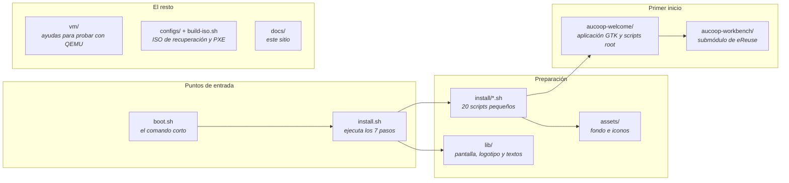

# Mapa del repositorio

Dónde está cada cosa cuando buscas el archivo que hace algo concreto.

## Pasos de preparación

`install.sh` los agrupa en los siete pasos que aparecen en pantalla. Cada archivo se puede leer en un minuto.

| Script | Función |
|---|---|
| `remove-apps.sh` | Elimina Firefox, LibreOffice, Thunderbird y el resto |
| `chrome.sh` | Instala Chrome y lo convierte en navegador predeterminado |
| `onlyoffice.sh` | Instala OnlyOffice y las asociaciones de archivos |
| `flathub.sh` | Añade Flathub al Gestor de software |
| `theme.sh`, `cursor.sh`, `wallpaper.sh` | Mint-Y-Blue, DMZ-White, fondo y pantalla de acceso de AUCOOP |
| `software-manager-icon.sh`, `update-manager.sh` | Cambian el icono y la política de actualizaciones |
| `desktop-shortcuts.sh` | Lanzadores de Word, Excel y PowerPoint |
| `panel.sh`, `menu-button.sh`, `menu-cleanup.sh`, `search-aliases.sh` | Barra, botón del menú, limpieza y alias de búsqueda |
| `branding.sh` | Logotipo y avatar del usuario |
| `aucoop-workbench.sh`, `aucoop-welcome.sh` | Instalan ambas aplicaciones en `/opt` |
| `mint-welcome.sh` | Impide que la bienvenida de Mint se abra al iniciar sesión |
| `codecs.sh`, `drivers.sh` | No forman parte de la ejecución predeterminada; los usa Welcome |

## Aplicación del primer inicio

Todo está en `aucoop-welcome/`:

| Archivo | Función |
|---|---|
| `aucoop_welcome.py` | Aplicación GTK: cinco pasos, conexión y progreso |
| `welcome_i18n.py` | Textos en inglés, español, catalán, francés y portugués |
| `modules.json` | Extras y modelos de IA con sumas, tamaños y licencias |
| `pkexec-runner.sh` | Única puerta hacia root; cada acción es un caso |
| `essential-setup.sh` | Actualizaciones, códecs y controladores; primero repara instalaciones incompletas |
| `schedule-setup.sh` | Instala el temporizador de systemd de las 22:00 |
| `remind-when-online.sh` | Espera la red, avisa y vuelve a abrir Welcome |
| `install-module.sh` | Instala un extra de `modules.json` (hoy, Kiwix) |
| `install-local-ai.sh` | Descarga y verifica el entorno y un modelo; crea el lanzador |
| `uninstall-local-ai.sh` | Elimina el asistente y libera espacio |
| `run-workbench-registration.sh` | Ejecuta Workbench contra una instancia de Devicehub |

## Pantalla del instalador

| Archivo | Función |
|---|---|
| `lib/ui.sh` | Animación, lista de pasos, barra, detalles y pantalla de error |
| `lib/logo.sh` | Logotipo en datos de celdas de medio bloque; generado |
| `lib/make-logo.py` | Lo regenera desde `assets/AUCOOP_logotip.png` |
| `lib/i18n.sh` | Textos del instalador en los cinco idiomas |

## El resto

`vm/` contiene las ayudas de QEMU utilizadas en las [pruebas](../testing/index.md). `configs/` y `build-iso.sh` construyen una ISO de recuperación basada en Clonezilla. `aucoop-workbench/` es un submódulo git que apunta al [workbench-script de eReuse](https://github.com/eReuse/workbench-script); recuerda usar `--recurse-submodules` al clonar.
