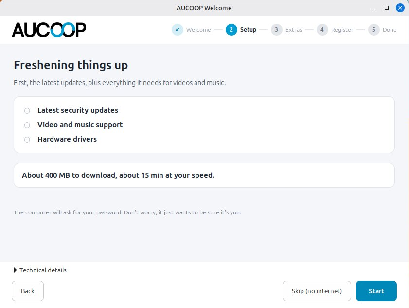
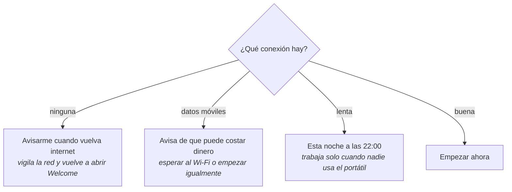
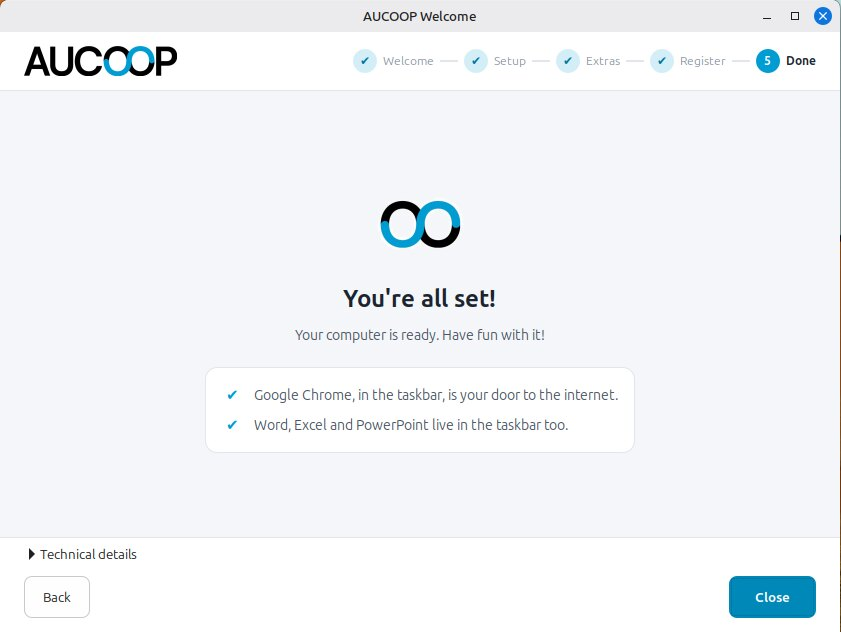

# Primer inicio: AUCOOP Welcome

El reinicio termina en la pantalla de acceso de AUCOOP. Inicia sesión y se abrirá una ventana:

Arriba aparecen cinco pasos; abajo están los botones para volver o avanzar y un panel plegado de «Detalles técnicos» para quien quiera ver los comandos. Puedes cerrar la ventana cuando quieras. Si la preparación no ha terminado, volverá a abrirse en el próximo inicio de sesión.

Pulsa **¡Empecemos!**. En esta primera página no se descarga nada.

## Pasos 1 y 2: actualizaciones y elementos básicos

Al avanzar, Welcome comprueba la conexión antes de descargar:

La cifra se mide, no se inventa. Welcome pregunta a apt cuánto descargaría, cronometra una muestra del servidor que contiene la mayor parte de los datos y hace el cálculo. La máquina de la captura encontró unos 400 MB. La cantidad cambiará a medida que la imagen de Mint envejezca y aparezcan nuevas actualizaciones.

La oferta depende de la conexión, algo importante en escuelas con enlaces poco fiables:

Pulsa **Empezar**, escribe la contraseña y trabajará en tres bloques: actualizaciones de seguridad, códecs para reproducir vídeo y música, y controladores del hardware. Cada bloque queda marcado al terminar. La línea inferior muestra el paquete que se está instalando para que una actualización larga no parezca bloqueada. Debajo van apareciendo consejos para la persona que utilizará el portátil.

Utiliza **Omitir (sin internet)** si ahora solo quieres recorrer Welcome. Podrás abrirlo de nuevo desde el icono del escritorio cuando la conexión esté lista.

## Paso 3: extras

Activa uno de los extras, o los dos, y pulsa **Instalar seleccionados**:

Hay dos opciones, ambas útiles sin internet:

**Wikipedia sin conexión** instala Kiwix, el lector. El contenido se descarga aparte y una Wikipedia completa ocupa varios gigabytes. Haz esa descarga con una buena conexión o copia el archivo desde una memoria USB.

**El asistente de IA sin conexión** ejecuta un pequeño modelo de lenguaje en el portátil. Welcome mide la memoria y el espacio libre, ofrece solo los modelos que caben, muestra su licencia y avisa claramente de que un asistente pequeño se equivoca. Tiene una [página propia](../use/offline-ai.md).

Abre **Más opciones** para elegir el modelo. Welcome muestra la memoria y el tamaño de descarga de cada uno, y oculta los que este ordenador no puede ejecutar:

La máquina de prueba de 8 GB ofrece cuatro modelos. Un portátil más modesto verá una lista más corta. El modelo sugerido es una buena opción general; elige uno menor si importa más el tiempo de descarga que la calidad de las respuestas.

También puedes omitir el paso entero y volver más tarde desde el icono AUCOOP Welcome del escritorio.

## Paso 4: registro

Este paso es para el voluntariado de AUCOOP, no para la persona que recibe el portátil. Ejecuta [Workbench](https://github.com/eReuse/workbench-script), lee el hardware y lo registra en Devicehub para saber dónde terminó cada máquina. Necesitas una instancia y un token. Si no los tienes, omite el paso.

El token funciona como una contraseña. No pongas un token real en una captura, un documento o un mensaje.

## Paso 5: terminado

La última página recuerda dónde está cada cosa: Chrome en la barra de tareas, las aplicaciones ofimáticas a su lado y los extras instalados. Si has aplicado actualizaciones en esta sesión, ofrecerá reiniciar para completarlas.

Al llegar aquí, Welcome deja de abrirse al iniciar sesión. El icono permanece en el escritorio para que puedas volver con un doble clic.
