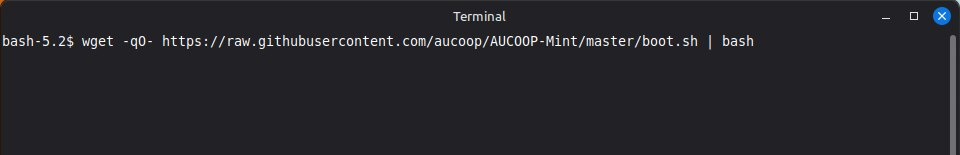
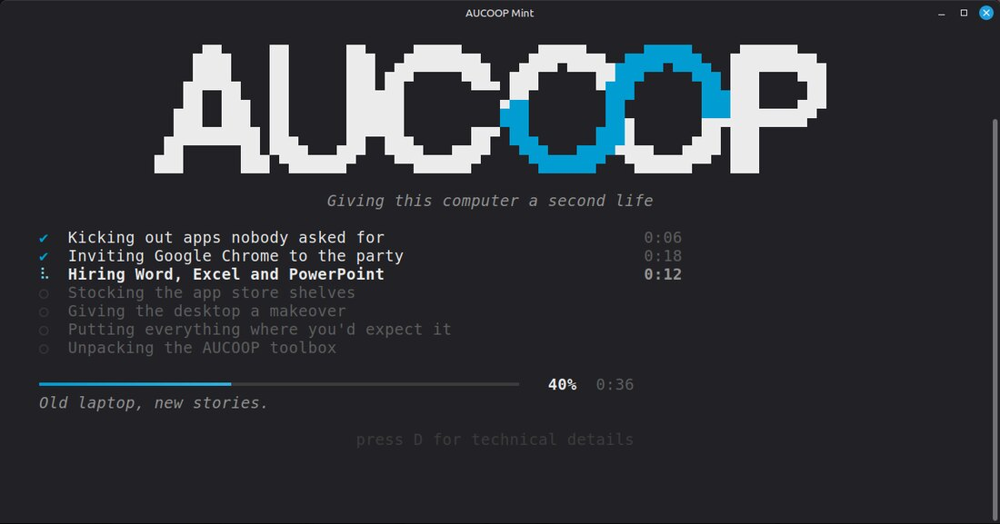
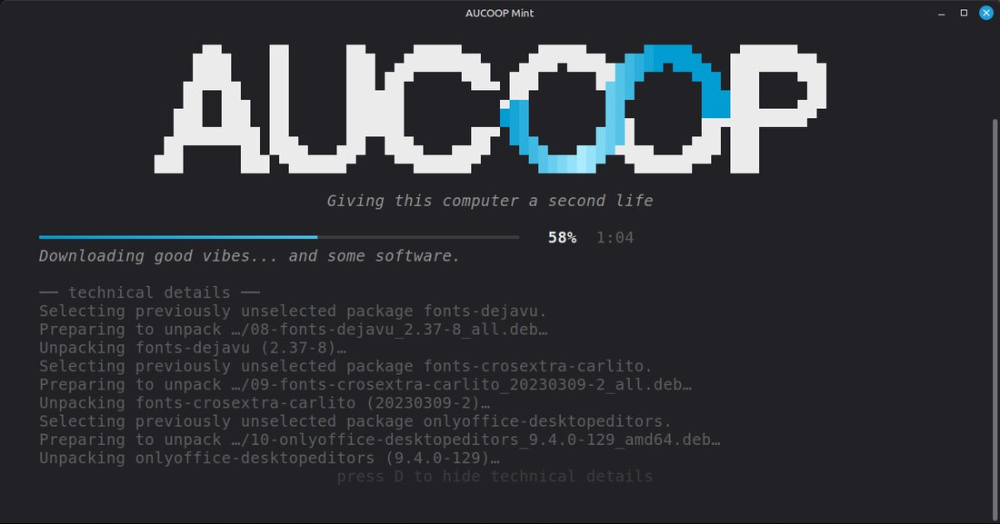
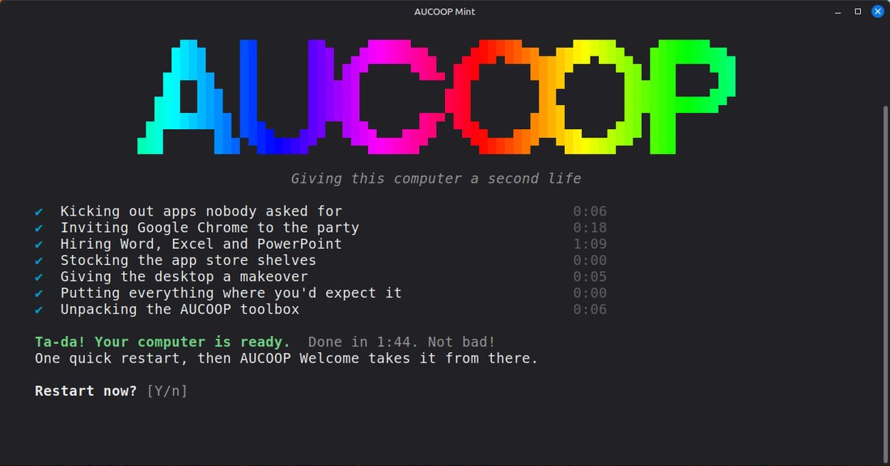

# Preparar un portátil

Empieza con un portátil que tenga Linux Mint 22.3 Cinnamon recién instalado y nada más. Necesitarás la contraseña de la cuenta y conexión a internet. Reserva media hora; pasarás casi todo ese tiempo esperando descargas.

## 1. Instalar Linux Mint

No hay ningún paso especial: utiliza el instalador normal de Mint desde una memoria USB.

Dos decisiones de esa instalación importan después. El idioma que elijas será el que utilice AUCOOP Mint; si el portátil va a una escuela de Mozambique, elige portugués ahora. Puedes dejar sin marcar «códecs multimedia», porque AUCOOP Welcome los instalará más tarde.

## 2. Ejecutar un comando

Abre un terminal en el equipo recién instalado y pega esto:

```bash
wget -qO- https://raw.githubusercontent.com/aucoop/AUCOOP-Mint/master/boot.sh | bash
```

Antes de pulsar **Intro** debería verse así:



Pedirá una vez la contraseña del ordenador. El cursor no se moverá mientras la escribes; Linux no muestra la contraseña, ni siquiera como puntos. Pulsa **Intro** cuando termines.

El instalador toma el control:



Hay siete pasos, cada uno con su cronómetro. Una máquina de prueba limpia tardó 1 minuto y 44 segundos; un portátil viejo o una conexión lenta necesitarán más. OnlyOffice suele ser la parte más lenta porque la descarga es grande.

Pulsa **D** en cualquier momento si quieres ver los comandos reales:



Pulsa **D** de nuevo para volver a la vista sencilla. El instalador guarda la misma salida en `~/.local/state/aucoop-mint/install.log`, tanto si el panel está abierto como si está cerrado.

Al terminar pregunta si quieres reiniciar:



Pulsa **Intro** para aceptar la opción predeterminada, **Y**, y reiniciar. El escritorio nuevo aparecerá después del reinicio.

### ¿Prefieres clonar el repositorio?

```bash
git clone https://github.com/aucoop/AUCOOP-Mint.git
cd AUCOOP-Mint
git submodule update --init --recursive
bash install.sh
```

El resultado es el mismo; el comando corto se limita a clonar por ti. Añade `--verbose` si prefieres ver la salida completa en vez de la pantalla de progreso.

## 3. Terminar en AUCOOP Welcome

Después del reinicio, inicia sesión. AUCOOP Welcome se abrirá solo con cinco pasos: bienvenida, preparación, extras, registro y fin. La [página siguiente](first-boot.md) explica cada uno.

## Qué cambia el comando

Elimina Firefox, LibreOffice, Thunderbird, Transmission, Hypnotix, Warpinator y algunas aplicaciones más que nadie suele abrir en un portátil escolar compartido.

Instala Google Chrome, OnlyOffice con accesos llamados Word, Excel y PowerPoint, y añade Flathub al Gestor de software.

Cambia el tema, el fondo, el cursor, la barra de tareas con sus aplicaciones ancladas y el botón del menú. También desactiva la bienvenida propia de Mint para que no aparezcan dos asistentes al iniciar sesión.

Deja para más tarde las actualizaciones del sistema, los códecs, los controladores y los extras opcionales. AUCOOP Welcome se ocupa de ellos para que puedas decidir cuándo gastar datos.

## Se puede ejecutar dos veces

Repetir el instalador es seguro. Los pasos terminados se saltan o se repiten sin causar daño. Si una descarga falló a medias o no sabes si acabó, ejecuta el mismo comando otra vez.

## Si falla

La pantalla de error indica qué paso falló, sugiere la causa y muestra las últimas líneas del registro. Nueve de cada diez veces es la red. Consulta [Solución de problemas](../troubleshooting.md) para ver los casos que hemos encontrado de verdad.

## Requisitos, en corto

Linux Mint 22.x Cinnamon, una conexión que funcione y ejecutar el comando desde la cuenta normal del escritorio. No lo ejecutes como root: el script se niega porque buena parte de su trabajo modifica la configuración de tu usuario.
