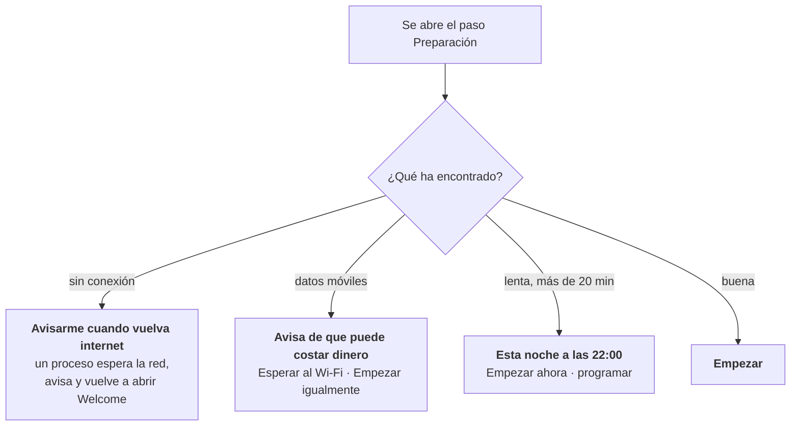

# Internet lenta, de pago o ausente

La conexión de muchos de estos portátiles será peor que la que tienes mientras lees esto. Algunas escuelas comparten un punto de acceso del teléfono, otras pagan por megabyte y otras pasan días sin internet. AUCOOP Welcome parte de esa realidad, en vez de dar por hecho que hay un cable rápido.

## Indica el coste antes de gastar datos

Antes de empezar las actualizaciones, Welcome pregunta a apt cuánto descargaría, cronometra unos megabytes del servidor que contiene la mayoría de los datos y muestra ambas cifras:

> Aproximadamente 600 MB de descarga y 12 min con esta conexión.

No descarga nada hasta que pulses Empezar.

## Cuatro situaciones, cuatro respuestas

**Sin conexión.** El recordatorio inicia un pequeño vigilante en segundo plano. Cuando vuelve internet, aparece una notificación y Welcome regresa comprobando ya la conexión. La preparación también continúa en el inicio automático, por lo que reaparecerá al iniciar sesión aunque el aviso no llegue.

**Datos móviles.** NetworkManager sabe si una conexión está marcada como de uso medido y Welcome transmite el aviso: la descarga puede costar dinero real. «Esperar al Wi-Fi» activa el mismo vigilante, esta vez hasta encontrar una conexión que no sea de pago.

**Lenta.** Si la estimación supera veinte minutos, Welcome ofrece trabajar a las 22:00, cuando nadie usa el portátil.

**Buena.** Basta con pulsar Empezar.

## Cómo funciona la ejecución nocturna

Elegir «Esta noche a las 22:00» pide la contraseña una vez e instala un temporizador de systemd:

- Si el portátil está apagado a las 22:00, el trabajo se hará la próxima vez que se encienda.
- Mantiene el equipo despierto durante la descarga y lo despierta de la suspensión cuando el hardware lo permite.
- Al terminar correctamente borra su propio temporizador. Si falla, vuelve a intentarlo la noche siguiente.
- Por la mañana Welcome indica: «El ordenador hizo los deberes esta noche. ¡Todo al día!».

Deja el portátil enchufado. Una actualización de apt nocturna con batería es una buena forma de acabar con el sistema a medio instalar.

## Cortes de corriente

La preparación empieza terminando lo que una ejecución anterior dejó a medias (`dpkg --configure -a` y `apt-get install -f`). Así, un portátil que se apagó durante una actualización se repara en el siguiente intento sin necesitar un terminal.

## Las descargas grandes se reanudan

El modelo de IA es la descarga grande: puede llegar a 9 GB. Si la conexión se corta, el siguiente intento continúa donde se quedó, reintenta por sí solo y comprueba el archivo terminado con su suma de verificación. El entorno de ejecución de 370 MB solo vuelve a descargarse cuando cambia de versión.

## Lo que todavía falta

No hay una caché compartida. Preparar treinta portátiles en un taller descarga lo mismo treinta veces. Un `apt-cacher-ng` local en el ordenador de una persona voluntaria, o una memoria USB con los `.deb`, modelos y archivos `.zim`, resolvería el problema. Está en la lista.
