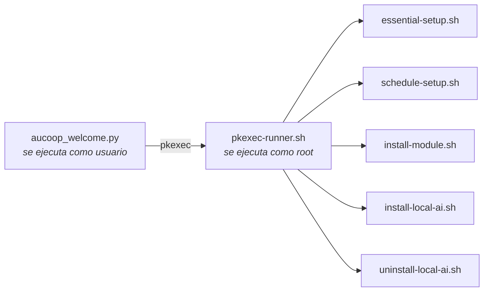

# Referencia técnica

Detalles que no encajan en las páginas de uso diario.

## Principios de diseño

**Menos es más.** Cada aplicación anclada es algo que la persona receptora utilizará. Quitamos el resto porque un menú con cuarenta entradas es peor que uno con ocho para alguien que nunca ha usado Linux.

**Tiene que funcionar en equipos antiguos.** Algunos portátiles tienen doce años, 4 GB de memoria y un disco mecánico. Eso descarta escritorios pesados y explica por qué el asistente de IA comprueba la memoria antes de ofrecer un modelo.

**Los hábitos de Windows sirven.** Barra abajo, menú en la esquina inferior izquierda y Word y Excel donde se esperan. Aquí importa más lo familiar que lo elegante.

## Por qué Linux Mint

| | Windows | Ubuntu (GNOME) | Linux Mint (Cinnamon) |
|---|---|---|---|
| Libre y gratuito | no | sí | sí |
| Funciona en un portátil de 2012 | mal | razonablemente | sí |
| Familiar para quien usa Windows | sí | no demasiado | sí |
| Soporte prolongado | sí | sí | sí, sigue Ubuntu LTS |

Mint 22.x sigue Ubuntu 24.04 LTS, con soporte hasta 2029. Mint 23 no llegará antes de diciembre de 2026, así que no hay prisa.

## Cambios de la preparación

**Eliminado:** firefox, libreoffice-*, thunderbird, hexchat, element-desktop, matrix-synapse, mintchat, warpinator, webapp-manager, transmission-gtk, seahorse, hypnotix.

**Instalado:** google-chrome-stable, onlyoffice-desktopeditors, flatpak con el remoto Flathub y las dependencias de Workbench: smartmontools, lshw, hwinfo, dmidecode, inxi, qrencode y pciutils.

**Configuración del escritorio:**

| Ajuste | Valor |
|---|---|
| Tema GTK e iconos | Mint-Y-Blue |
| Cursor | DMZ-White |
| Fondo y pantalla de acceso | Marca AUCOOP |
| Barra de tareas | Chrome, Archivos, Word, Excel, PowerPoint, Gestor de software |
| Alias de búsqueda | «app store» y «download» encuentran el Gestor de software |
| Bienvenida de Mint | desactivada mediante `~/.linuxmint/mintwelcome/norun.flag` |

Los lanzadores ofimáticos son archivos `.desktop` en `~/.local/share/applications/`, llamados Word, Excel y PowerPoint. Cada uno abre OnlyOffice con el argumento `--new:` correspondiente.

## Root y cómo se solicita

El instalador pide la contraseña una vez con `sudo -v` y mantiene viva la autorización durante la ejecución. AUCOOP Welcome funciona como el usuario y nunca llama a `sudo`: todas las acciones privilegiadas pasan por un script, de modo que el sistema muestra su propio diálogo.



Para añadir una acción privilegiada basta con añadir un caso a `pkexec-runner.sh`.

## Tareas del primer inicio

`essential-setup.sh` hace, por orden: reparar una instalación interrumpida, `apt-get update`, `apt-get upgrade`, instalar `mint-meta-codecs` y ejecutar `ubuntu-drivers autoinstall`. Registra el final en `/var/lib/aucoop-welcome/essential-setup-complete`; así Welcome sabe a la mañana siguiente que una ejecución nocturna terminó sin nadie conectado.

Welcome analiza la salida de apt para mostrar el progreso («Setting up 29 of 431 · libmount1»). `pkexec` limpia la configuración regional, por lo que apt escribe en inglés aunque el escritorio use otro idioma y el análisis se mantiene estable.

## IA sin conexión

`modules.json` contiene la lista de modelos. Cada entrada incluye URL, nombre, SHA-256, tamaño exacto, memoria mínima, licencia y enlace a la licencia. El entorno llamafile también está fijado allí, actualmente en la versión 0.10.6.

La instalación se niega pronto si falta memoria (con medio gigabyte de tolerancia, porque un portátil «de 8 GB» informa de unos 7,8) o espacio en disco. Reserva además un diez por ciento para no llenar la unidad. Las descargas se reanudan, reintentan y verifican con SHA-256 antes de recibir su nombre definitivo.

El lanzador generado espera a que el servidor responda antes de abrir el navegador, utiliza el siguiente puerto libre si 8091 está ocupado e inicia un vigilante que detiene el modelo tras diez minutos sin conexión del navegador.

## Idiomas

Cinco: inglés, español, catalán, francés y portugués. El instalador lee `lib/i18n.sh`; Welcome lee `welcome_i18n.py`. Ambos eligen el idioma de `LANGUAGE`, `LC_ALL`, `LC_MESSAGES` o `LANG`, por ese orden. Para una prueba, se puede forzar con `AUCOOP_LANG=fr`.

El portugués utiliza formas europeas (*ecrã*, *palavra-passe*, *transferir*), habituales en Angola y Mozambique.

## Registros

| Qué | Dónde |
|---|---|
| Preparación | `~/.local/state/aucoop-mint/install.log` |
| Comandos de Welcome | panel «Detalles técnicos», en directo |
| Ejecución nocturna | `/var/log/aucoop-essential-setup.log` |
| Asistente de IA | `/tmp/aucoop-local-ai.log` |

## Formas de desplegar

**Un portátil:** instalar Mint, ejecutar el comando, terminar en Welcome y entregarlo.

**Un lote:** preparar una máquina, capturarla con Clonezilla y restaurar las demás. Es más rápido y evita descargar en cada una. Los clones comparten nombre de equipo, machine-id y claves SSH; restablécelos o prepara la máquina de referencia en modo OEM de Mint para que cada persona cree su cuenta en el primer arranque.

**ISO de recuperación:**

```bash
sudo apt install squashfs-tools xorriso syslinux-common isolinux clonezilla drbl partclone
sudo ./build-iso.sh /path/to/clonezilla-image /path/to/debian-live-for-ocs.iso /path/to/output.iso
```

**Por red:** PXE, documentado en el [Community Network Handbook](https://github.com/aucoop/Community-Network-Handbook).

## Imagen de referencia

Linux Mint 22.3 «Zena» Cinnamon de 64 bits. Una instalación preparada ocupa unos 12 GB, cerca de 3,6 GB comprimida. La cuenta `aucoop` / `aucoop` es una convención de pruebas; utiliza algo razonable en máquinas que salgan del taller.

## Licencia

Los scripts y la configuración tienen licencia MIT. Linux Mint, Chrome, OnlyOffice, Kiwix, llamafile y los modelos mantienen sus propias licencias; Welcome muestra la del modelo antes de instalarlo.
