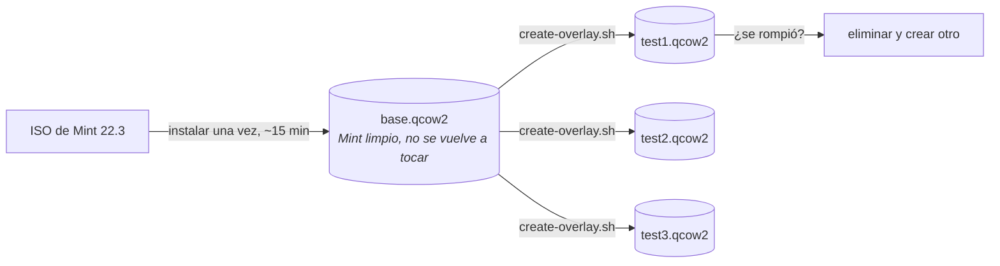

# Pruebas en una máquina virtual

No pruebes la preparación en el portátil que vas a entregar. Usa QEMU con discos superpuestos: instala Mint una sola vez en una imagen base y crea copias desechables para cada prueba.



La imagen superpuesta solo almacena los cambios; crear una nueva tarda un segundo y casi no ocupa disco.

## Preparación inicial

```bash
./vm/create-base-disk.sh ~/vms/mint-base.qcow2 40G
./vm/install-mint.sh ~/Downloads/linuxmint-22.3-cinnamon-64bit.iso ~/vms/mint-base.qcow2
```

Instala Mint con normalidad en la ventana. Crea el usuario `aucoop` y la contraseña `aucoop` (solo en máquinas de prueba) e instala el servidor SSH después del primer arranque:

```bash
sudo apt install openssh-server
```

Apaga la máquina virtual y no vuelvas a tocar la imagen base.

## Cada prueba

```bash
./vm/create-overlay.sh ~/vms/mint-base.qcow2 ~/vms/test.qcow2
./vm/run-overlay.sh ~/vms/test.qcow2 2222
```

Copia el árbol de trabajo y ejecuta el instalador como lo haría una persona voluntaria:

```bash
sshpass -p aucoop scp -P 2222 -r . aucoop@127.0.0.1:/home/aucoop/.aucoop-mint
sshpass -p aucoop ssh -t -p 2222 aucoop@127.0.0.1 'cd ~/.aucoop-mint && bash install.sh'
```

Utiliza `ssh -t`. El instalador pide una contraseña y dibuja en el terminal. Sin pseudoterminal estarías probando la salida sencilla de emergencia, no lo que ve una persona usuaria.

Después elimina la imagen superpuesta:

```bash
rm ~/vms/test.qcow2
```

## Cosas que conviene saber

**Comprueba el escritorio después de reiniciar.** Cinnamon reescribe parte de su configuración al cerrar la sesión; los cambios del panel y del tema solo aparecen correctamente tras reiniciar la máquina virtual e iniciar sesión otra vez.

**Abre AUCOOP Welcome desde el icono, no por SSH.** Las acciones privilegiadas usan `pkexec`, que exige que la aplicación pertenezca a la sesión gráfica. Si se lanza por SSH, intenta pedir la contraseña en un terminal inexistente y falla por un motivo ajeno al cambio que pruebas.

**Las capturas funcionan sin una ventana local.** `xdotool` y `scrot`, con `DISPLAY=:0`, permiten recorrer toda la interfaz desde un script. Así se hicieron las capturas de esta documentación.

**Cuidado con `pkill -f`.** Un patrón como `/opt/aucoop-ai/` también coincide con tu propio comando SSH si menciona esa ruta y mata la sesión. Sabemos que ocurre por experiencia.

## Por qué no usar una imagen de nube

Mint no publica ninguna, y tampoco serviría: casi todo lo que hace AUCOOP Mint modifica Cinnamon, dconf, archivos de escritorio y temas de iconos, elementos que no existen en una imagen de servidor sin interfaz. Usa la ISO real.
