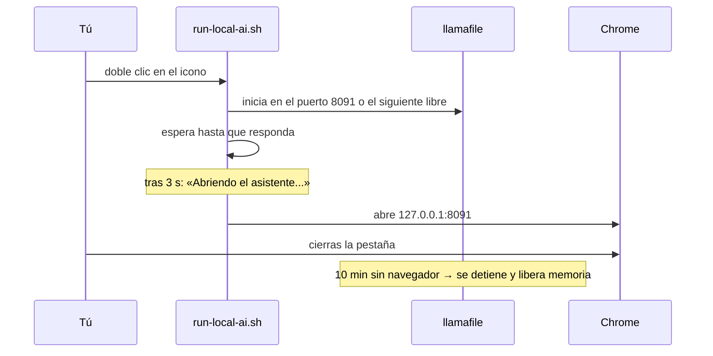

# El asistente de IA sin conexión

Pulsa el icono azul y se abrirá una página de chat en el navegador. Haz una pregunta y la respuesta saldrá del propio portátil, no de un servidor:


No hace falta una cuenta ni internet y no se envía nada fuera. El modelo está en `/opt/aucoop-ai` y escucha en `127.0.0.1`, por lo que solo ese ordenador puede acceder a él.

## Para qué sirve y para qué no

Explicar un concepto, preparar una carta, traducir una frase o ayudar con un ejercicio de matemáticas: ahí es donde un modelo pequeño resulta útil, sobre todo sin conexión.

Los datos son otra historia. Estos modelos son cien veces menores que los de un servicio de chat en línea e inventan respuestas con absoluta seguridad. En las pruebas, el antiguo modelo predeterminado (Qwen2.5 0.5B) afirmó que la fotosíntesis sucede en «plantas y animales» y repitió Asia en la lista de continentes. Por eso Welcome avisa en la propia tarjeta de que Wikipedia es más segura para consultar hechos, y por eso eliminamos los modelos más pequeños.

## Qué modelo corresponde a cada portátil

Welcome mide la memoria y el espacio libre, y solo ofrece lo que el ordenador puede ejecutar:


| Memoria | Modelo | Descarga | Licencia |
|---|---|---|---|
| 3 GB o más | Llama 3.2 1B | 0,8 GB | Llama 3.2 Community |
| 4 GB o más | Gemma 2 2B | 1,7 GB | Condiciones de Gemma |
| 6 GB o más | Llama 3.2 3B | 2,0 GB | Llama 3.2 Community |
| 8 GB o más | Phi-4 Mini | 2,5 GB | MIT |
| 16 GB o más | Qwen3 8B | 5,0 GB | Apache 2.0 |
| 24 GB o más | Qwen3 14B | 9,0 GB | Apache 2.0 |

Más grande significa mejor y también más lento. En una máquina de prueba con 8 GB, Llama 3.2 3B respondió una pregunta de dos frases en francés en unos 15 segundos, a unas 9 palabras por segundo. En un portátil antiguo de dos núcleos puede tardar entre tres y cinco veces más. Sigue sirviendo para un párrafo, pero no para una conversación rápida.

La licencia aparece junto al modelo con un enlace a su página. Instalarlo implica aceptar esas condiciones.

## Qué pasa al pulsar el icono



Ese último paso importa en un portátil de 4 GB: el modelo ocupa en memoria todo su tamaño mientras funciona. Dejarlo cargado consumiría una cuarta parte de la máquina. Pulsa otra vez el icono cuando quieras volver a iniciarlo.

## Desinstalarlo

Abre AUCOOP Welcome, ve a Extras y pulsa Eliminar. Detiene el asistente, borra el modelo y el entorno de ejecución, quita los iconos y recupera entre 0,8 y 9,4 GB según el modelo.

## Por dentro

El entorno de ejecución es [llamafile](https://github.com/mozilla-ai/llamafile), fijado en la versión 0.10.6. Tanto él como cada modelo se comprueban con SHA-256 antes de instalarse. Si una descarga reanudada no coincide con su suma, se descarta en vez de instalar un archivo roto; es el tipo de problema que solo aparece con malas conexiones y resulta horrible de depurar.

La página de chat es la interfaz web de llamafile. En el mismo puerto también ofrece una API compatible con OpenAI:

```bash
curl -s http://127.0.0.1:8091/v1/chat/completions \
  -H 'Content-Type: application/json' \
  -d '{"messages":[{"role":"user","content":"¿Cuál es la capital de Mozambique?"}]}'
```
