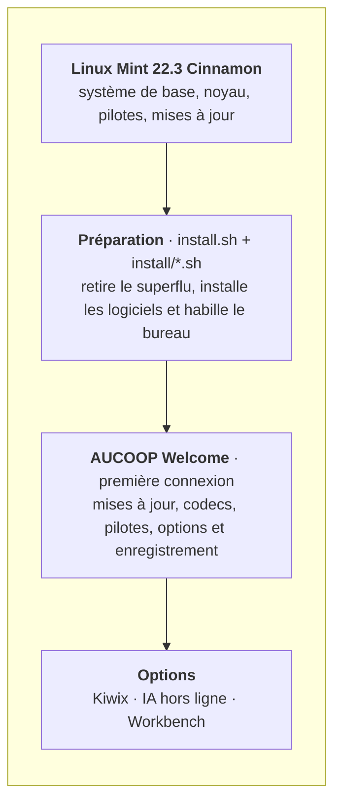
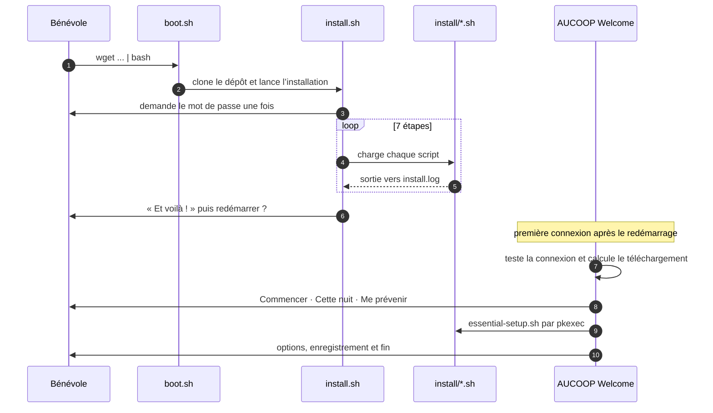

# Architecture

AUCOOP Mint constitue une couche au-dessus de Linux Mint, pas une distribution dérivée. Mint gère le programme d’installation, le noyau, les pilotes et les mises à jour de sécurité ; nous modifions l’apparence de la machine et les logiciels présents. Personne ici n’a donc à maintenir une distribution, et le portable reçoit les mises à jour de Mint tant que la série 22.x reste prise en charge.

## Deux moments distincts

Tout se déroule soit pendant la préparation, soit lors de la première connexion de la personne qui reçoit l’ordinateur. Cette séparation est volontaire : la préparation reste rapide et prévisible, tandis que le travail lent et gourmand en données attend que quelqu’un puisse choisir quand utiliser la connexion.

## Pourquoi cette architecture

**Des scripts shell plutôt qu’un gestionnaire de configuration.** Chaque étape tient dans un petit fichier `.sh` lisible. Un bénévole possédant les bases de Linux peut ouvrir `install/chrome.sh` et comprendre son action. Ansible ou Puppet n’apporterait rien ici, tout en ajoutant une dépendance.

**Des étapes relançables.** Tout peut s’exécuter deux fois. C’est indispensable lorsqu’un téléchargement s’interrompt sur une mauvaise liaison, situation courante sur le terrain.

**Une seule porte pour les privilèges.** AUCOOP Welcome ne tourne jamais en root. Lorsqu’il lui faut des droits, il appelle `pkexec-runner.sh` avec un nom d’action et le système demande lui-même le mot de passe. Une nouvelle action privilégiée ajoute un cas à cet endroit, pas des `sudo` dispersés dans une application GTK.

**Aucune connexion supposée au premier démarrage.** Le test arrive avant tout téléchargement et chaque chemin prévoit la réponse « pas maintenant ».

## Composants

| Élément | Emplacement | Langage |
|---|---|---|
| Commande d’amorçage | `boot.sh` | bash |
| Étapes de préparation | `install.sh`, `install/` | bash |
| Écran d’installation | `lib/ui.sh`, `lib/logo.sh` | bash |
| Textes du programme et de Welcome, 5 langues | `lib/i18n.sh`, `aucoop-welcome/welcome_i18n.py` | bash, Python |
| Application de première connexion | `aucoop-welcome/aucoop_welcome.py` | Python + GTK 3 |
| Actions privilégiées | `aucoop-welcome/pkexec-runner.sh` et scripts associés | bash |
| Enregistrement du matériel | `aucoop-workbench/` (sous-module) | Python |
| Construction de l’ISO de récupération | `build-iso.sh`, `configs/` | bash |

## Modifications du système

Logiciels retirés : Firefox, LibreOffice, Thunderbird, Transmission, Seahorse, Hypnotix, Warpinator, Webapp Manager et HexChat.

Logiciels ajoutés : Chrome, OnlyOffice avec les lanceurs Word, Excel et PowerPoint, Flathub, AUCOOP Welcome et Workbench.

Réglages : thème Mint-Y-Blue, pointeur DMZ-White, fond et écran de connexion AUCOOP, barre des tâches, icône du menu et alias de recherche. L’écran de bienvenue de Mint est aussi désactivé.

Éléments reportés à la première connexion : mises à jour, codecs, pilotes, Kiwix, assistant IA et enregistrement du matériel.
