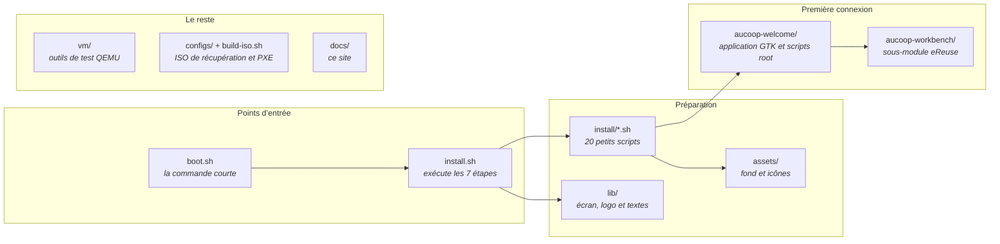

# Plan du dépôt

Où chercher le fichier qui réalise une action donnée.

## Étapes de préparation

`install.sh` les regroupe dans les sept étapes affichées. Chaque fichier est assez court pour se lire en une minute.

| Script | Rôle |
|---|---|
| `remove-apps.sh` | Supprime Firefox, LibreOffice, Thunderbird et le reste |
| `chrome.sh` | Installe Chrome et le définit comme navigateur par défaut |
| `onlyoffice.sh` | Installe OnlyOffice et les associations de fichiers |
| `flathub.sh` | Ajoute Flathub au gestionnaire de logiciels |
| `theme.sh`, `cursor.sh`, `wallpaper.sh` | Mint-Y-Blue, DMZ-White, fond et écran de connexion AUCOOP |
| `software-manager-icon.sh`, `update-manager.sh` | Remplacement de l’icône et politique de mise à jour |
| `desktop-shortcuts.sh` | Lanceurs Word, Excel et PowerPoint |
| `panel.sh`, `menu-button.sh`, `menu-cleanup.sh`, `search-aliases.sh` | Barre, bouton du menu, nettoyage et alias de recherche |
| `branding.sh` | Logo et avatar du compte |
| `aucoop-workbench.sh`, `aucoop-welcome.sh` | Installe les deux applications dans `/opt` |
| `mint-welcome.sh` | Empêche l’écran de bienvenue de Mint de s’ouvrir |
| `codecs.sh`, `drivers.sh` | Hors exécution par défaut ; utilisés par Welcome |

## Application de première connexion

Tout se trouve dans `aucoop-welcome/` :

| Fichier | Rôle |
|---|---|
| `aucoop_welcome.py` | Application GTK : cinq étapes, connexion et progression |
| `welcome_i18n.py` | Textes en anglais, espagnol, catalan, français et portugais |
| `modules.json` | Options et modèles avec sommes, tailles et licences |
| `pkexec-runner.sh` | Seule porte vers root ; chaque action correspond à un cas |
| `essential-setup.sh` | Mises à jour, codecs et pilotes ; répare d’abord les installations incomplètes |
| `schedule-setup.sh` | Installe le minuteur systemd de 22 h |
| `remind-when-online.sh` | Attend le réseau, prévient puis rouvre Welcome |
| `install-module.sh` | Installe une option de `modules.json` (Kiwix aujourd’hui) |
| `install-local-ai.sh` | Télécharge et vérifie l’environnement et un modèle ; écrit le lanceur |
| `uninstall-local-ai.sh` | Supprime l’assistant et libère l’espace |
| `run-workbench-registration.sh` | Lance Workbench vers une instance Devicehub |

## Écran du programme d’installation

| Fichier | Rôle |
|---|---|
| `lib/ui.sh` | Animation, étapes, barre, détails et écran d’erreur |
| `lib/logo.sh` | Logo sous forme de cellules en demi-blocs, généré |
| `lib/make-logo.py` | Le régénère depuis `assets/AUCOOP_logotip.png` |
| `lib/i18n.sh` | Textes dans les cinq langues |

## Le reste

`vm/` contient les outils QEMU utilisés pour les [tests](../testing/index.md). `configs/` et `build-iso.sh` construisent une ISO de récupération fondée sur Clonezilla. `aucoop-workbench/` est un sous-module git pointant vers le [workbench-script d’eReuse](https://github.com/eReuse/workbench-script) ; pensez à `--recurse-submodules` lors du clonage.
