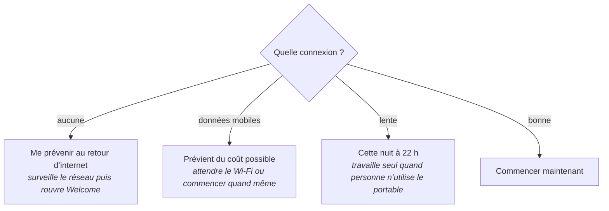
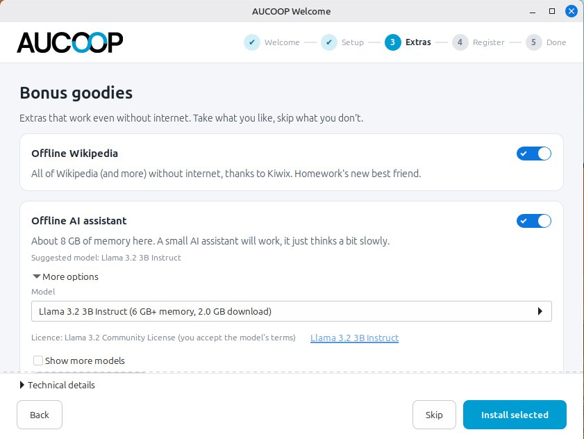

# Première connexion : AUCOOP Welcome

Le redémarrage mène à l’écran de connexion AUCOOP. Connectez-vous ; une fenêtre s’ouvre :

Cinq étapes figurent en haut. Les boutons de navigation et un volet « Détails techniques » replié se trouvent en bas. Vous pouvez fermer la fenêtre à tout moment ; si la préparation n’est pas terminée, elle reviendra lors de la prochaine connexion.

Cliquez sur **C’est parti !**. Cette première page ne télécharge rien.

## Étapes 1 et 2 : mises à jour et éléments essentiels

En avançant, Welcome vérifie la connexion avant tout téléchargement :

Le chiffre est mesuré, pas deviné. Welcome demande à apt le volume nécessaire, chronomètre un échantillon depuis le miroir qui fournit la majorité des données, puis fait le calcul. La machine de la capture a trouvé environ 400 Mo. Cette quantité évolue à mesure que l’image de Mint vieillit et que de nouvelles mises à jour arrivent.

La proposition dépend de la connexion, ce qui compte beaucoup dans les écoles mal desservies :

Cliquez sur **Commencer**, saisissez le mot de passe et laissez travailler les trois blocs : mises à jour de sécurité, codecs pour la vidéo et la musique, puis pilotes matériels. Chaque bloc reçoit une coche lorsqu’il se termine. La ligne du dessous nomme le paquet en cours, afin qu’une longue mise à jour ne ressemble pas à un blocage. Des conseils défilent plus bas pour la personne qui utilisera l’ordinateur.

Utilisez **Passer (pas d’internet)** si vous souhaitez seulement parcourir Welcome. Vous pourrez le rouvrir depuis le bureau lorsque la connexion sera disponible.

## Étape 3 : options

Activez l’une des options, ou les deux, puis cliquez sur **Installer la sélection** :

Ces deux options restent utiles sans internet :

**Wikipédia hors ligne** installe Kiwix, le lecteur. Le contenu se télécharge séparément et une Wikipédia complète occupe plusieurs gigaoctets. Faites-le avec une bonne connexion ou copiez le fichier depuis une clé USB.

**L’assistant IA hors ligne** exécute un petit modèle de langage sur l’ordinateur. Welcome mesure la mémoire et l’espace libre, ne propose que les modèles compatibles, affiche leur licence et prévient clairement qu’un petit assistant peut se tromper. Une [page entière](../use/offline-ai.md) lui est consacrée.

Ouvrez **Plus d’options** pour choisir le modèle. Welcome affiche la mémoire et la taille du téléchargement, puis masque les modèles que cette machine ne peut pas faire tourner :

La machine de test de 8 Go propose quatre modèles. Un portable moins puissant verra une liste plus courte. Le modèle suggéré constitue un bon choix général ; prenez-en un plus petit si le temps de téléchargement compte davantage que la qualité des réponses.

Vous pouvez également ignorer cette étape et revenir plus tard grâce à l’icône AUCOOP Welcome sur le bureau.

## Étape 4 : enregistrement

Cette étape concerne les bénévoles d’AUCOOP, pas la personne qui reçoit l’ordinateur. Elle exécute [Workbench](https://github.com/eReuse/workbench-script), relève le matériel et l’enregistre dans Devicehub pour conserver la destination de chaque machine. Il faut une instance et un jeton. Si vous ne les avez pas, passez cette étape.

Le jeton fonctionne comme un mot de passe. Ne placez jamais un vrai jeton dans une capture, un document ou un message.

## Étape 5 : terminé

La dernière page rappelle où se trouvent les éléments : Chrome dans la barre des tâches, les logiciels bureautiques à côté et les options installées. Si des mises à jour ont eu lieu, elle propose un redémarrage pour les terminer.

Une fois cette page atteinte, Welcome ne s’ouvre plus à chaque connexion. Son icône reste sur le bureau ; un double clic suffit pour revenir.
