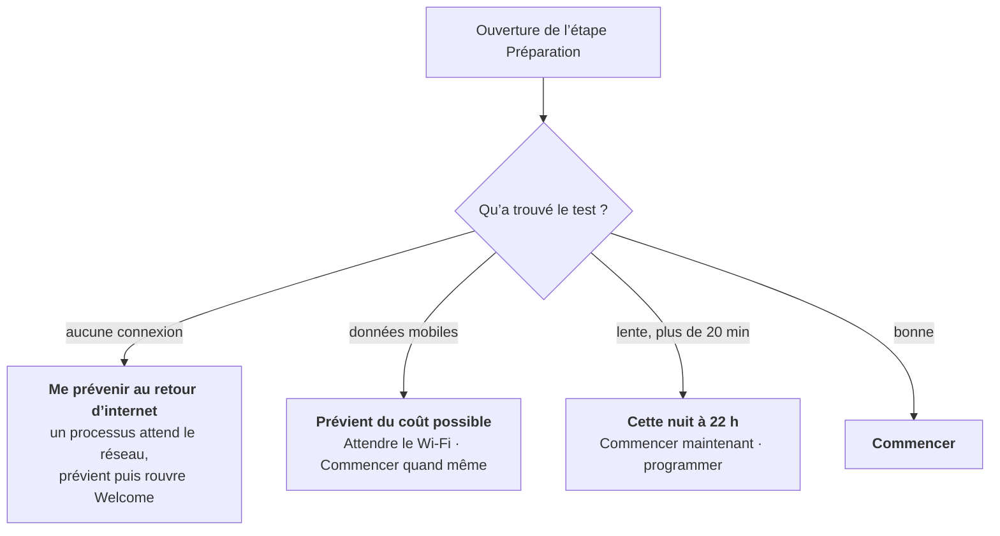

# Connexion lente, payante ou absente

Beaucoup de ces ordinateurs finiront dans un endroit où la connexion est moins bonne que celle dont vous disposez en lisant cette page. Certaines écoles partagent le point d’accès d’un téléphone, d’autres paient au mégaoctet et certaines restent plusieurs jours sans réseau. AUCOOP Welcome part de cette réalité au lieu de supposer qu’un câble rapide existe.

## Le coût apparaît avant toute dépense

Avant les mises à jour, Welcome demande à apt le volume à télécharger, chronomètre quelques mégaoctets depuis le miroir principal et affiche les deux valeurs :

> Environ 600 Mo à télécharger, environ 12 min avec votre connexion.

Rien n’est téléchargé avant d’appuyer sur Commencer.

## Quatre situations, quatre propositions

**Aucune connexion.** Le rappel lance un petit processus en arrière-plan. Quand le réseau revient, une notification apparaît et Welcome se rouvre en vérifiant déjà la connexion. La préparation reste aussi dans le démarrage automatique et reviendra donc à la prochaine connexion.

**Données mobiles.** NetworkManager sait si une connexion est facturée au volume et Welcome transmet l’avertissement : le téléchargement peut coûter de l’argent. « Attendre le Wi-Fi » lance le même processus, mais attend cette fois une connexion non facturée.

**Lente.** Si l’estimation dépasse vingt minutes, Welcome propose de travailler à 22 h, lorsque personne n’utilise l’ordinateur.

**Bonne.** Il suffit de cliquer sur Commencer.

## Fonctionnement de l’exécution nocturne

« Cette nuit à 22 h » demande le mot de passe une fois, puis installe un minuteur systemd :

- Si la machine est éteinte à 22 h, le travail s’effectue au prochain démarrage.
- Elle reste éveillée pendant le téléchargement et sort de veille lorsque le matériel le permet.
- Après une réussite, le minuteur se supprime. Après un échec, il réessaie la nuit suivante.
- Le matin, Welcome annonce : « L’ordinateur a fait ses devoirs cette nuit. Tout est à jour ! »

Laissez l’ordinateur branché. Une mise à niveau apt nocturne sur batterie peut laisser le système à moitié installé.

## Coupures de courant

La préparation commence par terminer ce qu’une exécution précédente a laissé en plan (`dpkg --configure -a` et `apt-get install -f`). Un portable éteint pendant une mise à jour se répare donc lors de la tentative suivante, sans terminal.

## Reprise des gros téléchargements

Le modèle d’IA représente le plus gros fichier, jusqu’à 9 Go. Si la connexion tombe, la prochaine tentative reprend au même endroit, réessaie automatiquement et vérifie le fichier avec sa somme de contrôle. L’environnement de 370 Mo ne revient que lorsque sa version change.

## Ce qui manque encore

Il n’existe pas encore de cache partagé. Préparer trente portables dans un atelier télécharge trente fois les mêmes fichiers. Un `apt-cacher-ng` local sur l’ordinateur d’un bénévole, ou une clé USB contenant les `.deb`, les modèles et les archives `.zim`, résoudrait ce problème. C’est prévu.
