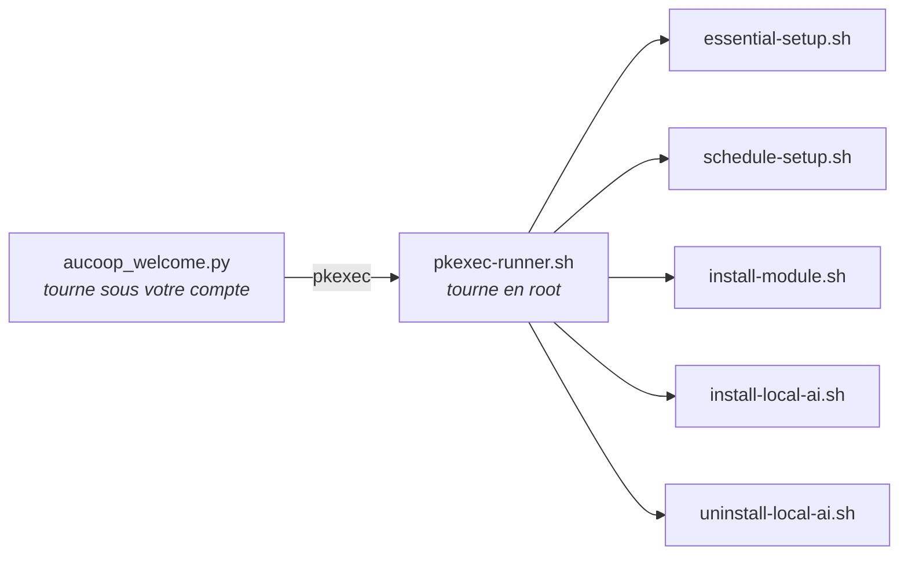

# Référence technique

Les détails qui n’ont pas leur place sur les pages d’utilisation courante.

## Principes de conception

**Moins, c’est mieux.** Chaque application épinglée sert à la personne qui reçoit l’ordinateur. Nous retirons le reste, car un menu de quarante entrées aide moins qu’un menu de huit lorsqu’on n’a jamais utilisé Linux.

**Le système doit tourner sur du matériel ancien.** Certains portables ont douze ans, 4 Go de mémoire et un disque mécanique. Cela exclut les bureaux lourds et explique pourquoi l’assistant IA vérifie la mémoire avant de proposer un modèle.

**Les habitudes de Windows restent utiles.** Barre des tâches en bas, menu dans le coin inférieur gauche, Word et Excel à leur place habituelle. Ici, le familier l’emporte sur l’élégant.

## Pourquoi Linux Mint

| | Windows | Ubuntu (GNOME) | Linux Mint (Cinnamon) |
|---|---|---|---|
| Libre et gratuit | non | oui | oui |
| Fonctionne sur un portable de 2012 | mal | assez bien | oui |
| Familier pour une personne venant de Windows | oui | pas vraiment | oui |
| Prise en charge longue durée | oui | oui | oui, suit Ubuntu LTS |

Mint 22.x suit Ubuntu 24.04 LTS, pris en charge jusqu’en 2029. Mint 23 n’est pas prévu avant décembre 2026 ; rien ne presse.

## Modifications apportées

**Supprimés :** firefox, libreoffice-*, thunderbird, hexchat, element-desktop, matrix-synapse, mintchat, warpinator, webapp-manager, transmission-gtk, seahorse, hypnotix.

**Installés :** google-chrome-stable, onlyoffice-desktopeditors, flatpak et le dépôt Flathub, ainsi que les dépendances de Workbench : smartmontools, lshw, hwinfo, dmidecode, inxi, qrencode et pciutils.

**Réglages du bureau :**

| Réglage | Valeur |
|---|---|
| Thème GTK et icônes | Mint-Y-Blue |
| Pointeur | DMZ-White |
| Fond et écran de connexion | identité AUCOOP |
| Barre des tâches | Chrome, Fichiers, Word, Excel, PowerPoint, Gestionnaire de logiciels |
| Alias de recherche | « app store » et « download » trouvent le Gestionnaire de logiciels |
| Écran de bienvenue Mint | désactivé par `~/.linuxmint/mintwelcome/norun.flag` |

Les lanceurs bureautiques sont des fichiers `.desktop` dans `~/.local/share/applications/`, nommés Word, Excel et PowerPoint. Chacun ouvre OnlyOffice avec l’argument `--new:` correspondant.

## Root et demande de privilèges

Le programme demande une fois les droits avec `sudo -v` et maintient l’autorisation active pendant toute l’exécution. AUCOOP Welcome tourne sous le compte utilisateur et n’appelle jamais `sudo` : chaque action privilégiée traverse un seul script, ce qui laisse le système afficher sa propre fenêtre de mot de passe.



Ajouter une action privilégiée revient à ajouter un cas à `pkexec-runner.sh`, rien de plus.

## Tâches de première connexion

`essential-setup.sh` exécute dans l’ordre : réparation d’une installation interrompue, `apt-get update`, `apt-get upgrade`, installation de `mint-meta-codecs`, puis `ubuntu-drivers autoinstall`. Il inscrit la réussite dans `/var/lib/aucoop-welcome/essential-setup-complete`, afin que Welcome sache le lendemain matin qu’une exécution nocturne s’est terminée sans session ouverte.

Welcome analyse la sortie d’apt pour afficher la progression (« Setting up 29 of 431 · libmount1 »). `pkexec` efface la langue de l’environnement ; apt écrit donc en anglais quelle que soit la langue du bureau, ce qui stabilise cette analyse.

## IA hors ligne

`modules.json` contient les modèles. Chaque entrée indique l’URL, le nom de fichier, le SHA-256, la taille exacte, la mémoire minimale, la licence et son lien. L’environnement llamafile est également fixé dans ce fichier, actuellement en version 0.10.6.

L’installation refuse immédiatement une machine sans assez de mémoire (avec une tolérance d’un demi-gigaoctet, puisqu’un portable « 8 Go » déclare environ 7,8 Go) ou d’espace disque. Elle réserve dix pour cent supplémentaires afin de ne pas remplir le disque. Les téléchargements reprennent, réessaient et passent une vérification SHA-256 avant de recevoir leur nom définitif.

Le lanceur attend une réponse du serveur avant d’ouvrir le navigateur, passe au port libre suivant si 8091 est occupé et démarre un processus qui arrête le modèle après dix minutes sans navigateur.

## Langues

Cinq : anglais, espagnol, catalan, français et portugais. Le programme lit `lib/i18n.sh`, tandis que Welcome lit `welcome_i18n.py`. Ils choisissent la langue dans `LANGUAGE`, `LC_ALL`, `LC_MESSAGES` ou `LANG`, dans cet ordre. Pour les tests, `AUCOOP_LANG=fr` permet de la forcer.

Le portugais emploie les formes européennes (*ecrã*, *palavra-passe*, *transferir*), utilisées en Angola et au Mozambique.

## Journaux

| Élément | Emplacement |
|---|---|
| Préparation | `~/.local/state/aucoop-mint/install.log` |
| Commandes de Welcome | volet « Détails techniques », en direct |
| Exécution nocturne | `/var/log/aucoop-essential-setup.log` |
| Assistant IA | `/tmp/aucoop-local-ai.log` |

## Méthodes de déploiement

**Un ordinateur :** installer Mint, exécuter la commande, terminer dans Welcome et le remettre.

**Une série :** préparer une machine, la capturer avec Clonezilla et restaurer les autres. C’est plus rapide et chaque machine n’a pas besoin d’internet. Les clones partagent leur nom d’hôte, machine-id et clés SSH ; réinitialisez-les ou préparez la référence avec le mode OEM de Mint afin que chaque destinataire crée son compte au premier démarrage.

**ISO de récupération :**

```bash
sudo apt install squashfs-tools xorriso syslinux-common isolinux clonezilla drbl partclone
sudo ./build-iso.sh /path/to/clonezilla-image /path/to/debian-live-for-ocs.iso /path/to/output.iso
```

**Par le réseau :** PXE, documenté dans le [Community Network Handbook](https://github.com/aucoop/Community-Network-Handbook).

## Image de référence

Linux Mint 22.3 « Zena » Cinnamon, 64 bits. Une installation préparée occupe environ 12 Go sur le disque et 3,6 Go comprimés. Le compte `aucoop` / `aucoop` sert uniquement aux tests ; choisissez autre chose pour une machine qui quitte l’atelier.

## Licence

Les scripts et la configuration sont sous licence MIT. Linux Mint, Chrome, OnlyOffice, Kiwix, llamafile et les modèles conservent leurs propres licences ; Welcome affiche celle du modèle avant son installation.
