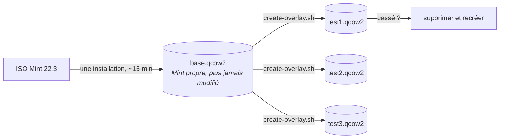

# Tests dans une machine virtuelle

Ne testez jamais la préparation sur l’ordinateur que vous allez donner. Utilisez QEMU et des disques superposés : installez Mint une seule fois dans une image de base, puis créez des copies jetables pour les essais.



Une image superposée ne conserve que les changements. Sa création prend une seconde et presque aucun espace disque.

## Préparation initiale

```bash
./vm/create-base-disk.sh ~/vms/mint-base.qcow2 40G
./vm/install-mint.sh ~/Downloads/linuxmint-22.3-cinnamon-64bit.iso ~/vms/mint-base.qcow2
```

Installez Mint normalement dans la fenêtre. Créez l’utilisateur `aucoop` avec le mot de passe `aucoop` (uniquement pour les tests), puis installez le serveur SSH après le premier démarrage :

```bash
sudo apt install openssh-server
```

Éteignez la machine virtuelle et ne touchez plus à l’image de base.

## Chaque essai

```bash
./vm/create-overlay.sh ~/vms/mint-base.qcow2 ~/vms/test.qcow2
./vm/run-overlay.sh ~/vms/test.qcow2 2222
```

Copiez l’arbre de travail puis exécutez le programme comme le ferait un bénévole :

```bash
sshpass -p aucoop scp -P 2222 -r . aucoop@127.0.0.1:/home/aucoop/.aucoop-mint
sshpass -p aucoop ssh -t -p 2222 aucoop@127.0.0.1 'cd ~/.aucoop-mint && bash install.sh'
```

Utilisez `ssh -t`. Le programme demande un mot de passe et dessine dans le terminal. Sans pseudo-terminal, vous testeriez la sortie de secours simplifiée plutôt que l’écran réel.

Supprimez ensuite l’image superposée :

```bash
rm ~/vms/test.qcow2
```

## Points à connaître

**Vérifiez les changements du bureau après un redémarrage.** Cinnamon réécrit une partie de sa configuration à la fermeture de session. Le panneau et le thème n’apparaissent correctement qu’après avoir redémarré la machine virtuelle et vous être reconnecté.

**Lancez AUCOOP Welcome depuis son icône, pas par SSH.** Les actions privilégiées passent par `pkexec`, qui doit rattacher l’application à la session graphique. Depuis SSH, il tente de demander le mot de passe dans un terminal absent et échoue pour une raison sans rapport avec votre modification.

**Les captures fonctionnent sans fenêtre locale.** `xdotool` et `scrot`, avec `DISPLAY=:0`, permettent de parcourir toute l’interface depuis un script. Les captures de cette documentation ont été réalisées ainsi.

**Attention à `pkill -f`.** Un motif comme `/opt/aucoop-ai/` correspond aussi à votre propre ligne de commande SSH si elle mentionne ce chemin, puis tue votre session. Nous l’avons appris à nos dépens.

## Pourquoi pas une image cloud

Mint n’en publie pas, et elle ne servirait guère : l’essentiel d’AUCOOP Mint touche Cinnamon, dconf, les fichiers de bureau et les thèmes d’icônes, absents d’une image serveur sans interface. Utilisez l’ISO réelle.
