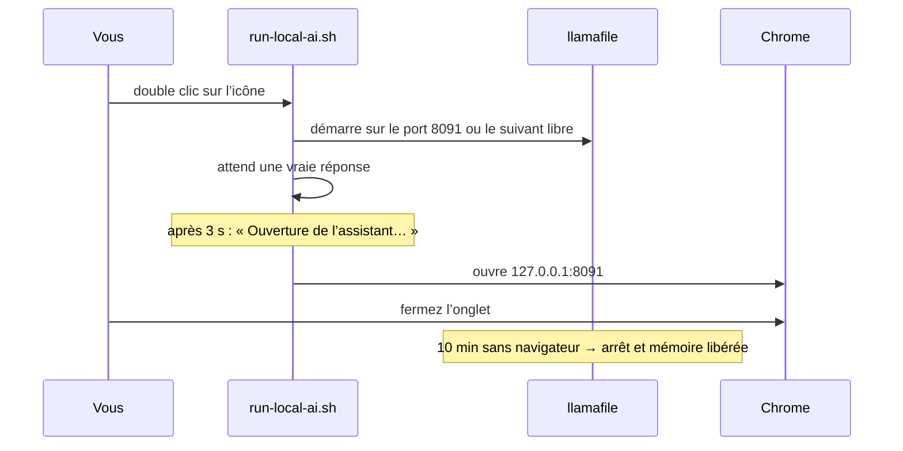

# L’assistant IA hors ligne

Cliquez sur l’icône bleue. Une page de discussion s’ouvre dans le navigateur ; la réponse vient de l’ordinateur lui-même, pas d’un serveur :


Aucun compte, aucune connexion et aucune donnée envoyée. Le modèle se trouve dans `/opt/aucoop-ai` et écoute sur `127.0.0.1`, ce qui signifie que seul cet ordinateur peut y accéder.

## Ce qu’il sait faire, et ses limites

Expliquer une notion, rédiger une lettre, traduire une phrase ou aider pour un exercice de mathématiques : un petit modèle se montre utile dans ces tâches, surtout sans connexion.

Les faits demandent plus de prudence. Ces modèles sont cent fois plus petits que ceux des services en ligne et inventent parfois une réponse avec une assurance parfaite. Lors de nos tests, l’ancien modèle par défaut (Qwen2.5 0.5B) a affirmé que la photosynthèse avait lieu chez « les plantes et les animaux » et a cité l’Asie deux fois parmi les continents. C’est pourquoi Welcome indique sur la carte que Wikipédia reste plus sûre pour les faits et pourquoi les plus petits modèles ont été retirés.

## Quel modèle pour quel ordinateur

Welcome mesure la mémoire et l’espace libre, puis ne propose que ce que la machine peut exécuter :


| Mémoire | Modèle | Téléchargement | Licence |
|---|---|---|---|
| 3 Go et plus | Llama 3.2 1B | 0,8 Go | Llama 3.2 Community |
| 4 Go et plus | Gemma 2 2B | 1,7 Go | Conditions de Gemma |
| 6 Go et plus | Llama 3.2 3B | 2,0 Go | Llama 3.2 Community |
| 8 Go et plus | Phi-4 Mini | 2,5 Go | MIT |
| 16 Go et plus | Qwen3 8B | 5,0 Go | Apache 2.0 |
| 24 Go et plus | Qwen3 14B | 9,0 Go | Apache 2.0 |

Un modèle plus grand répond mieux, mais plus lentement. Sur une machine de test de 8 Go, Llama 3.2 3B a répondu à une question de deux phrases en français en environ 15 secondes, à presque 9 mots par seconde. Un vieux double cœur sera trois à cinq fois plus lent. Cela reste acceptable pour un paragraphe, pas pour une conversation rapide.

La licence apparaît à côté du modèle avec un lien vers sa page. Son installation vaut acceptation de ces conditions.

## Ce qui se passe après un clic



Cette dernière étape compte sur une machine de 4 Go : le modèle occupe toute sa taille en mémoire lorsqu’il tourne. Le laisser chargé utiliserait un quart de la machine. Cliquez de nouveau sur l’icône pour le relancer.

## Le supprimer

Ouvrez AUCOOP Welcome, allez à l’étape Options et cliquez sur Supprimer. L’assistant s’arrête, le modèle et l’environnement sont effacés, les icônes disparaissent et entre 0,8 et 9,4 Go sont récupérés selon le modèle.

## Fonctionnement interne

L’environnement repose sur [llamafile](https://github.com/mozilla-ai/llamafile), fixé à la version 0.10.6. Son SHA-256 et celui de chaque modèle sont vérifiés avant l’installation. Si un téléchargement repris ne correspond plus à sa somme, le fichier est supprimé au lieu d’installer des données corrompues ; ce problème survient surtout sur les mauvaises connexions et se révèle pénible à diagnostiquer.

La page de discussion est l’interface web de llamafile. Une API compatible avec OpenAI est également disponible sur le même port :

```bash
curl -s http://127.0.0.1:8091/v1/chat/completions \
  -H 'Content-Type: application/json' \
  -d '{"messages":[{"role":"user","content":"Quelle est la capitale du Mozambique ?"}]}'
```
