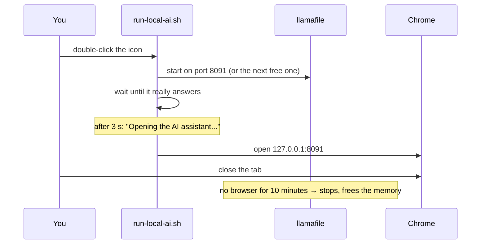

# The offline AI assistant

Click the blue icon and a chat page opens in the browser. Ask it something, and the answer comes from the laptop itself, not from a server:


No account, no internet, nothing sent anywhere. The model file sits in `/opt/aucoop-ai` and the whole thing listens on `127.0.0.1`, which means only that computer can reach it.

## What it's good for, and what it isn't

Explaining a concept, drafting a letter, translating a sentence, helping with a maths exercise: that's where a small model earns its place, especially with no connection.

Facts are a different story. These models are a hundred times smaller than what you get from a chat service online, and they invent things with total confidence. When we tested the old default (Qwen2.5 0.5B) it claimed that photosynthesis happens in "plants and animals", and listed Asia twice among the continents. That's why AUCOOP Welcome says, right on the card, that Wikipedia is the safer place for facts, and why the smallest models were dropped from the list entirely.

## Which model ends up on which laptop

Welcome measures the memory and the free disk, then offers only what the machine can run:

| Memory | Model | Download | Licence |
|--------|-------|----------|---------|
| 3 GB+ | Llama 3.2 1B | 0.8 GB | Llama 3.2 Community |
| 4 GB+ | Gemma 2 2B | 1.7 GB | Gemma Terms of Use |
| 6 GB+ | Llama 3.2 3B | 2.0 GB | Llama 3.2 Community |
| 8 GB+ | Phi-4 Mini | 2.5 GB | MIT |
| 16 GB+ | Qwen3 8B | 5.0 GB | Apache 2.0 |
| 24 GB+ | Qwen3 14B | 9.0 GB | Apache 2.0 |

Bigger is better, and slower. On an 8 GB test machine Llama 3.2 3B answered a two-sentence question in French in about 15 seconds, at roughly 9 words a second. Expect three to five times slower on an old dual-core laptop, which is still usable for a paragraph but not for a conversation.

The licence appears next to the model with a link to its page, and installing it means accepting those terms.

## What happens when you click the icon



That last part matters on a 4 GB laptop: the model holds its whole size in memory while it runs, so leaving it loaded would cost you a quarter of the machine. Click the icon again and it starts back up.

## Removing it

AUCOOP Welcome, Extras step, Remove. It stops the assistant, deletes the model and the runtime, takes the icons away, and gives you back between 0.8 and 9.4 GB depending on which model was installed.

## Under the hood

The runtime is [llamafile](https://github.com/mozilla-ai/llamafile), pinned to version 0.10.6 and checked against its SHA-256 before installation, as is every model. A resumed download that doesn't match its checksum gets thrown away rather than installed, which is the kind of thing that only happens on bad connections and is miserable to debug when it does.

The chat page is llamafile's own web interface, and it also exposes an OpenAI-compatible API on the same port if you want to build something against it:

```bash
curl -s http://127.0.0.1:8091/v1/chat/completions \
  -H 'Content-Type: application/json' \
  -d '{"messages":[{"role":"user","content":"Qual é a capital de Moçambique?"}]}'
```
